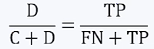

# 머신러닝 모델의 평가지표

## 지도학습 모델의 평가지표

### 회귀 모델의 평가 지표

* RMSE (Root Mean square error)
  * 
* R-square (결정계수)
  * 
* MAE (Mean absoulte error)
  * 
  * 오차의 부호만 제거해서 이를 평균한 값
  * MAE가 10이면 오차가 평균적으로 10정도 발생한다고 이해
* MAPE (Mean average percentage error)
  * 
  * 실제 값 대비 오차가 차지하는 비중이 평균적으로 얼마인지 확인

### 분류 모델의 평가 지표

* 정오(교차)분류표 (confusion matrix)

* 

* 

  * 정확도, 정분류율(Accuracy)

    * 전체 관찰치 중 정분류된 관찰치의 비중
    * 

  * 정밀도(Precision)

    * Positive로 예측한 것 중에서 실제 범주도 Positive인 비율
    * 

  * 재현율(Recall)

    * 실제 범주가 Positive인 것 중에서 Positive로 예측된 데이터의 비율
    * 

  * ROC(Receiver operating characteristic) 도표

    * 분류의 결정 임계값(threshold)에 따라 달라지는 TPR(민감도, sensitivity)과 FPR(1-특이도, 1-specificity)의 조합을 도표로 나타냄

      1. TPR - True Positive Rate(=sensitivity(민감도)) : 1인 케이스에 대해 1로 잘 예측한 비율

      2. FPR - False Positive Rate(=1-specificity(특이도)) : 0인 케이스에 대해 1로 잘못 예측한 비율

      3. 임계값이 1이면 FPR=0, TPR=0

      4. 임계값을 1에서 0으로 낮춰감에 따라 FPR과 TPR은 동시에 증가함

      5. FPR이 증가하는 정도보다 TPR이 빠르게 증가하면 이상적 -> 왼쪽 위 꼭지점에 가까울수록 좋음

         

  * AUC(Area under the curve)

    * ROC 곡선 아래의 면적
    * 가운데 대각선의 직선은 랜덤한 수준의 이진분류에 대응되며, 이 경우 AUC는 0.5임
    * 1에 가까울수록 좋은 수치. FPR이 작을 때 얼마나 큰 TPR을 얻는지에 따라 결정됨

