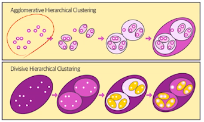
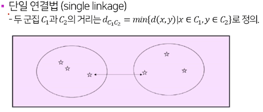
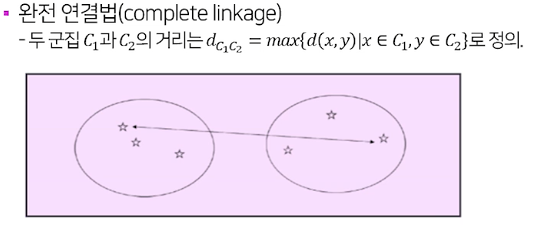
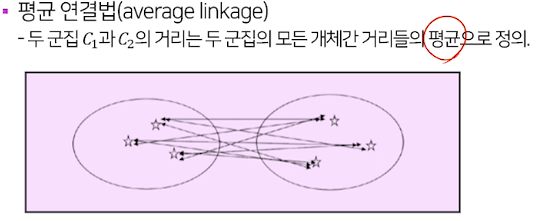
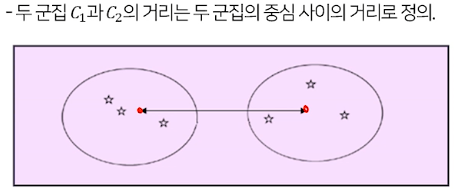
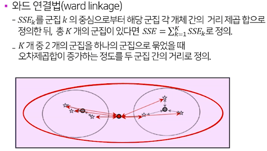
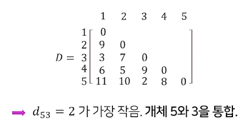
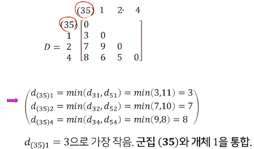
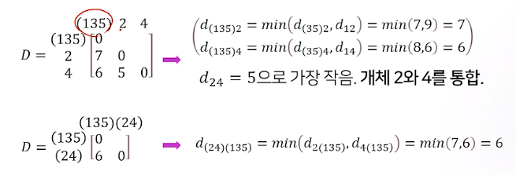
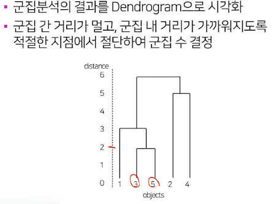

# 계층적 군집분석

## 군집분석이란

* 어떤 개체나 대상들을 밀접한 유사성 또는 비유사성에 의하여 유사한 특성을 지닌 개체들을 몇개의 군집으로 집단화하는 비지도 학습법
* 각 군집의 특성, 군집간의 차이 등에 대한 탐색대상으로, 집단에 대한 심화된 이해가 목적
* 특이 군집의 발견, 결측값의 보정 등에도 사용될 수 있음

## 군집의 조건

* 동일 군집에 속한 개체끼리는 유사한 속성이 매우 많음
* 다른 군집에 속하는 개체끼리는 유사한 속성이 매우 적음

## 계층적 군집분석 개요

* 병합적(agglomerative) vs 분할적(divisive)
  * 병합적 : 개체 간 거리가 가까운 개체끼리 차례로 묶어주는 방법으로 군집을 정의
  * 분할적 : 개체 간 거리가 먼 개체끼리 나누어 가는 방법으로 군집을 정의
  * 계층적 군집분석에서는 병합적 방법이 주로 사용됨

### 개체 간 거리 및 군집 간 거리의 정의

* 개체 간 거리
  * 유클리디안 거리
  * 맨해튼 거리
  * 민코우스키 거리
* 군집 간 거리
  * 단일 연결법(최단 연결법, single linkage)
  * 완전 연결법(최장 연결법, complete linkage)
  * 평균 연결법(average linkage)
  * 중심 연결법(centroid linkage)
  * ward 연결방법(ward linkage)

### 군집 간 거리

### 병합적 방법에서 단일 연결법 사용 군집분석 예시

