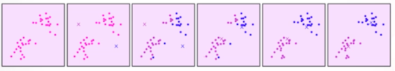
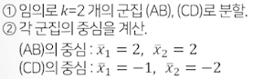
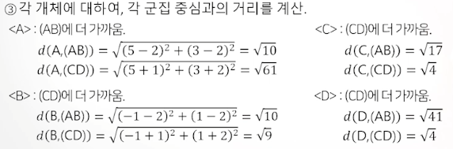
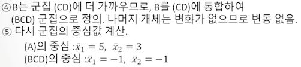
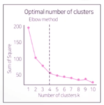

# 비계층적 군집분석(K-MEANS Clustering)

## K-평균 군집분석

* 사전에 결정된 군집 수 k에 기초하여, 전체 데이터를 상대적으로 유사한 k개의 군집으로 구분
* 계층적 방식에 비하여 계산량이 적고, 대용량 데이터를 빠르게 처리함
* 사전에 적절한 군집 수 k에 대한 예상이 필요
* 초기에 군집 중심이 어디로 지정되는지에 따라 최종 결과가 영향을 많이 받음
* 잡음이나 이상치의 영향을 많이 받음

### K-평균 군집분석 알고리즘

* 개체를 k개의 초기 군집으로 나눈다
* 각 군집의 중심을 계산한 뒤 모든 개체들을 각 군집의 중심에 가장 가까운 군집에 할당시킨다
* 새로운 개체를 받아들이거나 잃은 군집의 중심을 다시 계산한다
* 위 과정을 더 이상의 재배치가 생기지 않을 때까지 반복한다
* 

### K-평균 군집분석 예시

| 관찰치 | X1   | X2   |
| ------ | ---- | ---- |
| A      | 5    | 3    |
| B      | -1   | 1    |
| C      | 1    | -2   |
| D      | -3   | -2   |

### K-평균 군집분석에서 적절한 군집 수의 결정

* 오차제곱합(SSE)
  * 각 군집 내 개체들과 해당 군집 중심점과의 거리를 제곱한 값들의 합
  * 오차제곱합이 작을수록 군집 내 유사성이 높아 잘 응집된 것임
* 군집수 K에 따른 SSE의 변화를 Elbow차트로 시각한 뒤, SSE가 급격히 감소하다가 완만해지기 시작하는 시점의 k를 적정 군집수로 판단함

