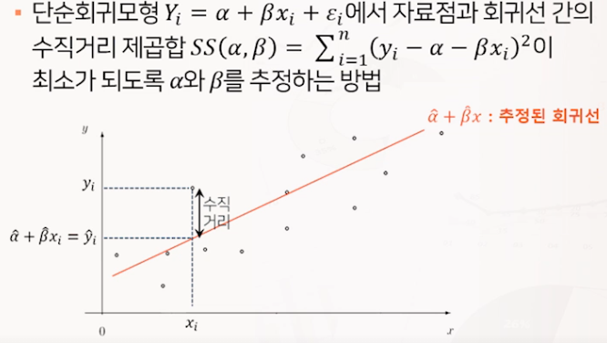
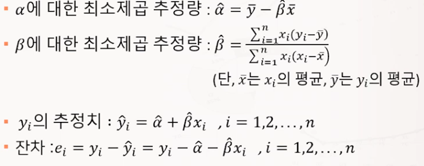
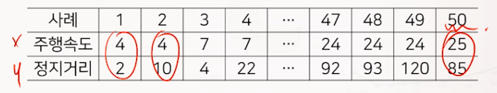
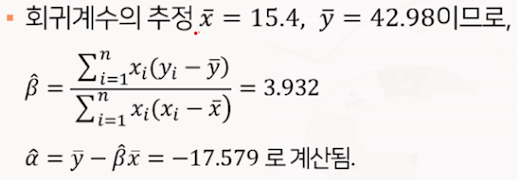
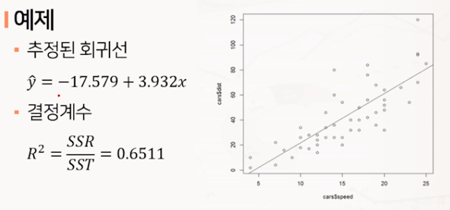
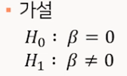
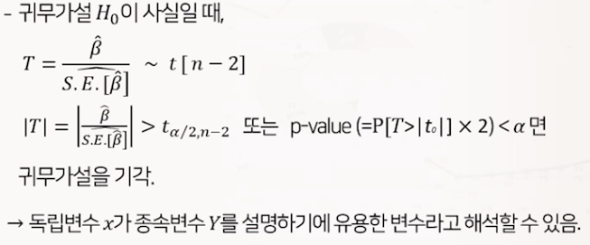
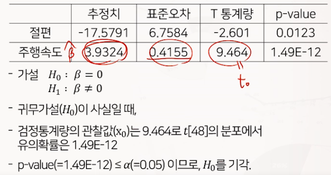
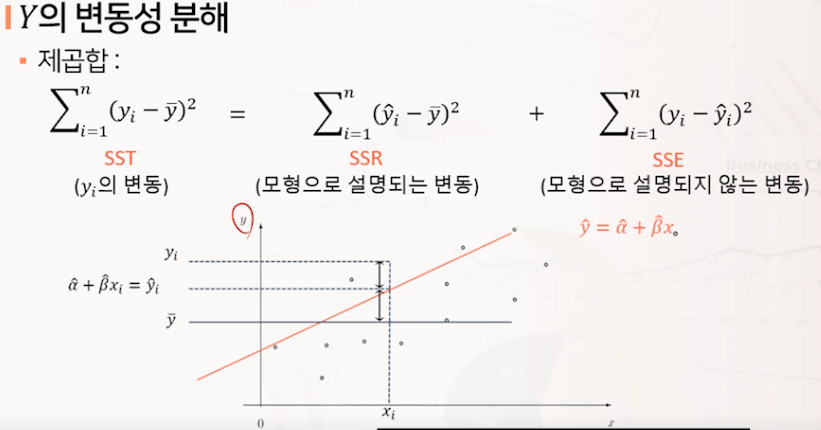
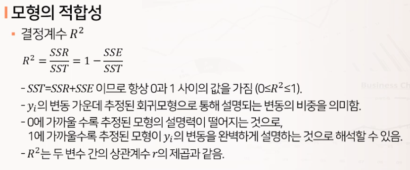

# 단순회귀분석

## 회귀분석

* 독립변수와 종속변수 간의 함수적인 관련성을 규면하기 위하여 어떤 수학적 모형을 가정하고, 이 모형을 측정된 자료로부터 통계적으로 추정하는 분석방법
* y=f(x)의 함수 관계가 있을 때,
  * x를 설명변수 또는 독립변수
    * 단순회귀 : 독립변수가 1개
    * 다중회귀 : 독립변수가 2개 이상
  * y를 반응변수 또는 종속변수
* 오차항인 ei(입실론 i)는 서로 독립인 확률변수로 정규분포를 따른다 : 정규, 등분산, 독립 가정

## 단순선형회귀모형의 모수 추정

### 모수 추정

모형이 포함한 미지의 모수 a,b를 추정하기 위하여 각 독립변수 xi에 대응하는 종속변수 yi로 짝지어진 n개의 표본인 관측치 (xi,yi)가 주어짐

* 최소제곱법
  * 단순회귀모형 Yi = a + bxi + ei 에서 자료점
  * 
  * 

### 예제

* 자동차의 주행속도와 정지거리에 관한 50개의 표본 자료를 이용하여, 주행거리를 독립변수로, 정지거리를 종속변수로 두고 단순 선형회귀모형을 적합하고자 함
* 

  

  

## 단순선형회귀모형의 유의성 검정

### 모형의 유의성 t 검정

* 독립변수 x가 종속변수 Y를 설명하기에 유용한 변수인가에 대한 통계적 추론은 회귀계수 B에 대한 검정을 통해 파악할 수 있음
* 
* 검정통계량과 표본분포
* 

### 예제

* 베타에 관한 유의성을 유의수준 5%로 검정할 것
* 

## 단순선형회귀모형의 적합도

