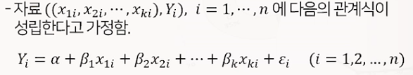
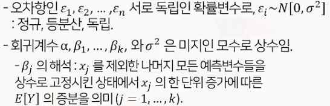
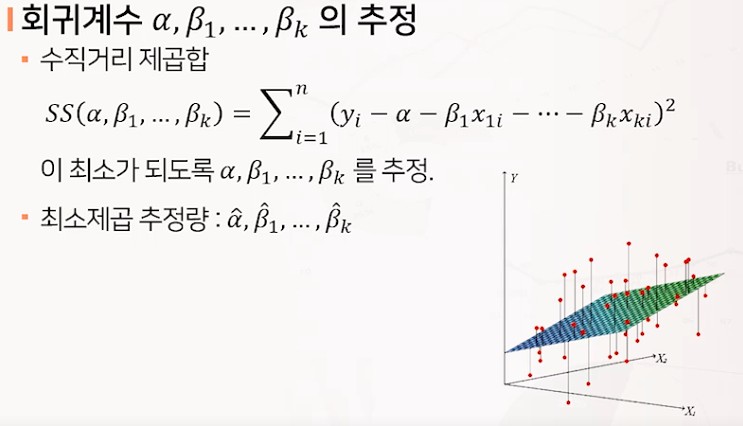
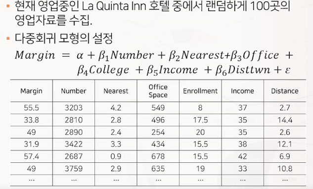
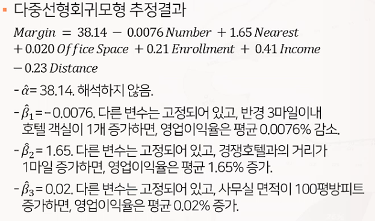
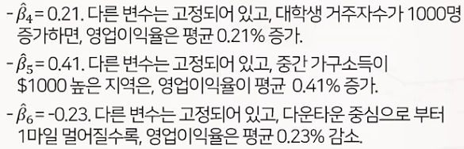
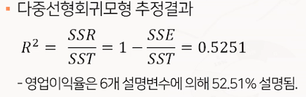
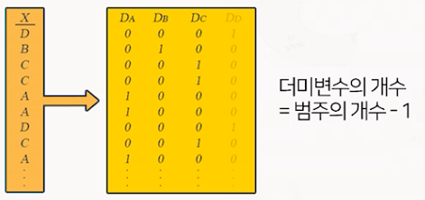
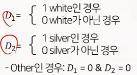
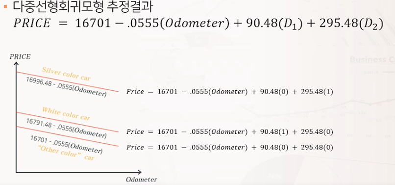

# 다중회귀분석

## 다중선형회귀모형으로의 확장

* 다중 선형회귀모형
  * 독립변수가 두개 이상인 선형회귀모형
  * 여러개의 독립변수를 이용하면 종속변수의 변화를 더 잘 설명할 수 있을 것임
  * 
  * 

## 다중선형회귀모형

### 다중회귀모형 분석 예시

## 범주형 독립변수가 포함된 회귀모형

### 범주형 독립변수가 포함된 회귀모형

* 범주형 독립변수를 회귀모형에 포함하기 위해서는 더미변수 기법을 이용
* 더미변수는 0 또는 1의 값을 갖는 변수로 아래와 같이 정의됨
* 

### 범주형 독립변수 예시 : 중고차 가격에 관한 예측 모형

* 중고차 시장에서 차량의 주행거리와 색상이 차량의 가격에 어떤 영향을 미치는지 파악하고자 2013년형 A브랜드 중고차 100대에 관한 자료를 수집
* 종속변수 : 가격
* 독립변수 : 
  * 주행거리
  * 차량색상 : 범주형
* Color의 더미변수 : 범주의 수가 3개 -> 2개의 더미변수 (D1, D2)를 생성
* 
* 
