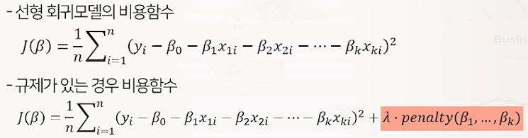
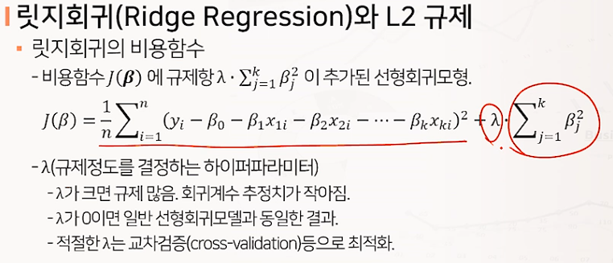
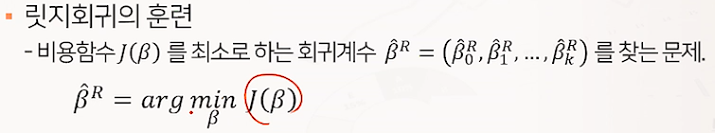
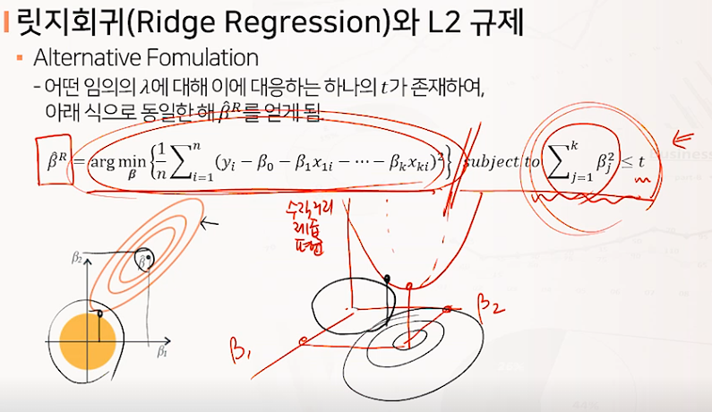
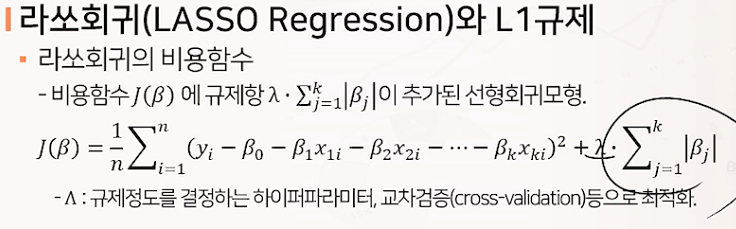
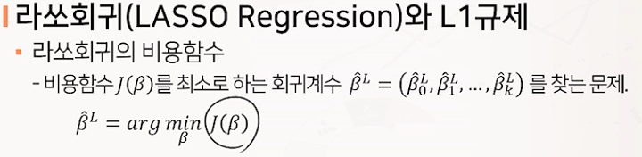
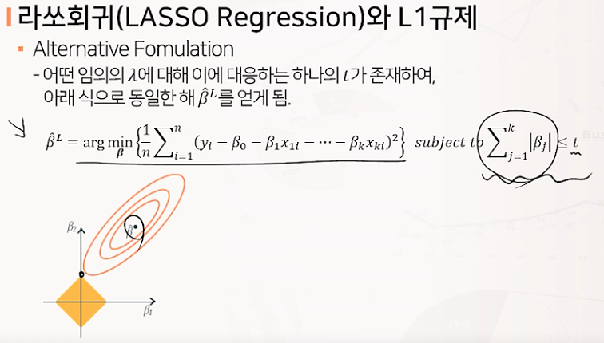
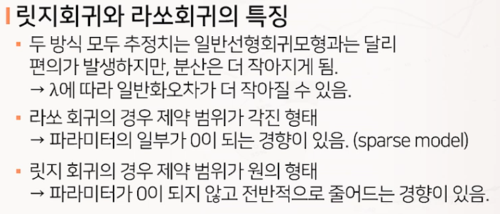
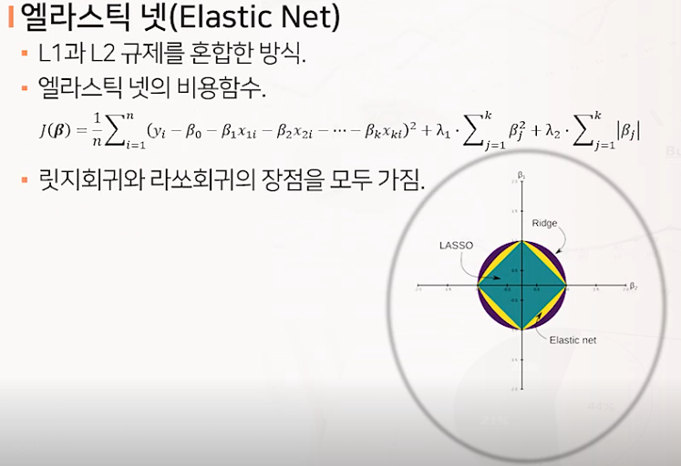

# 규제가 있는 선형 회귀모델 (Ridge, Lasso, Elastic Net)

## 선형회귀모델의 규제

* 모형의 과대적합을 막기 위한 규제방법으로 선형회귀모형에서는 보통 모델의 가중치를 제한하는 방법을 사용함

* 가중치를 제한하는 방법에 따른 규제 선형회귀모델의 종류
  * 릿지(p=2) - L2 norm
  * 라쏘(p=1) - L1 norm
  * 엘라스틱넷

## 릿지회귀와 L2 규제

## 라쏘회귀와 L1 규제

## 릿지회귀와 라쏘회귀의 특징

## 엘라스틱넷

