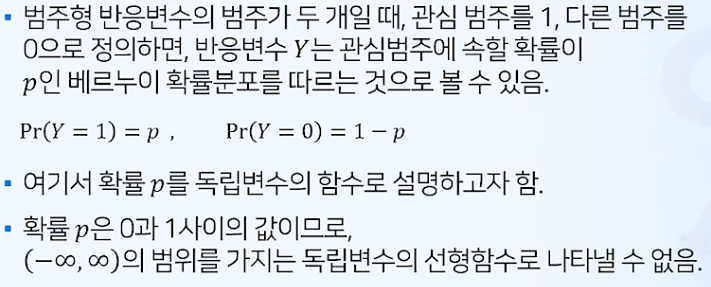

# 로지스틱회귀

## 로지스틱 회귀모형

* 로지스틱 회귀분석은 선형 회귀분석과 달리 반응변수가 범주형 데이터인 경우에 사용되는 기법
* 새로운 설명변수의 값이 주어질 때 반응변수의 각 범주에 속할 확률이 얼마인지를 추정하고, 추정확률을 분류기준값에 따라 분류하는 목적으로 사용됨

## 이항 로지스틱 회귀모형

## 로지스틱 모형식의 이해

## 추정 및 예측

## 로지스틱 회귀모형의 분리경계면

## 로지스틱 회귀와 오즈비

## 이항 로지스틱 회귀모형 사례

