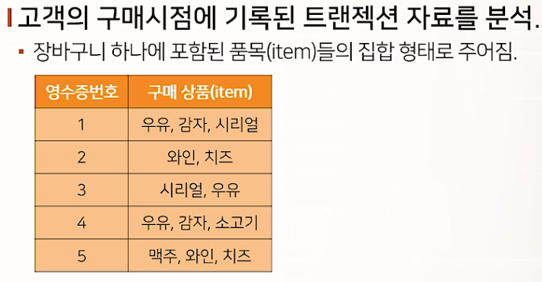
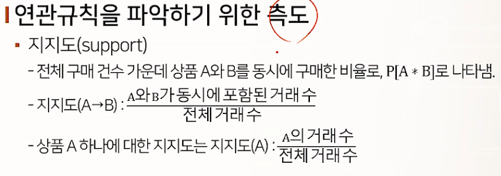
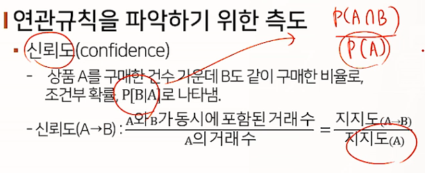
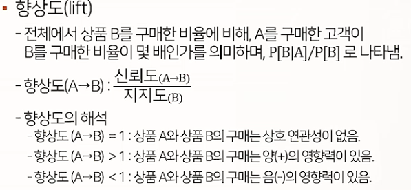
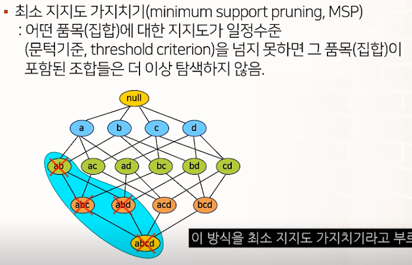
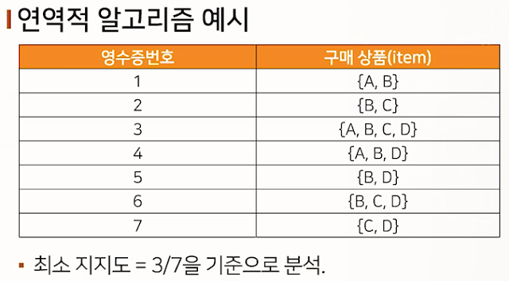
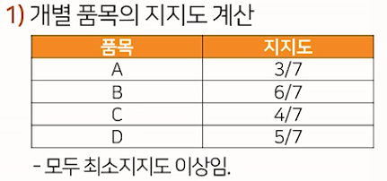
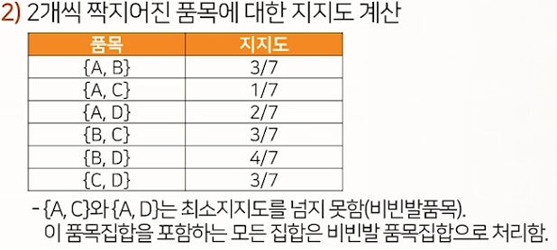
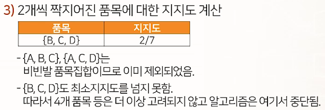
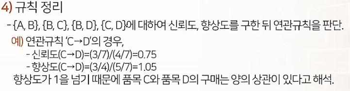

# 추천 : 연관성 분석

## 연관성 분석

* 연관성 규칙을 통해 하나의 거래나 사건에 포함되어 있는 둘 이상의 품목 간 상호 연관성을 발견하는 과정
* 고객이 동시에 구매하는 상품 간의 관계를 분석한다는 의미에서 장바구니 분석이라고도 함
* 항목들 간의 if item A -> then item B 형태로 표현되는 유용한 패턴
  * 예) {onion, potato} => {meat}

## 연관규칙의 탐색 및 평가

### 고객의 구매시점에 기록된 트랜젝션 자료를 분석

### 연관규칙을 파악하기 위한 측도

## 연역적(apriori) 알고리즘

* 품목들의 집합 별로 지지도, 신뢰도, 향상도 지표를 구해야 하는데, 품목의 수가 많을 때는 연관규칙의 탐색 비용이 크게 증가함
* 연역적 알고리즘은 더 이상 탐색하지 않아도 될 품목의 조합을 찾고, 그 조합을 부분집합으로 갖는 품목의 집합들을 가지치기(pruning)하여, 효율적인 탐색을 하도록 함
* 

### 연역적 알고리즘 예시

