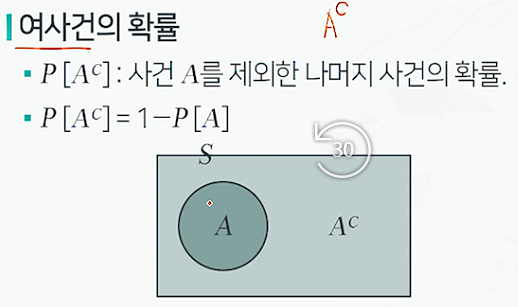
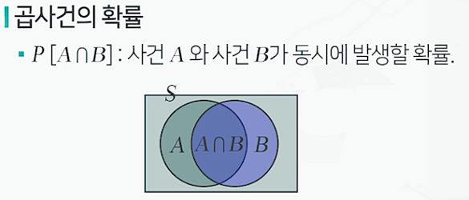
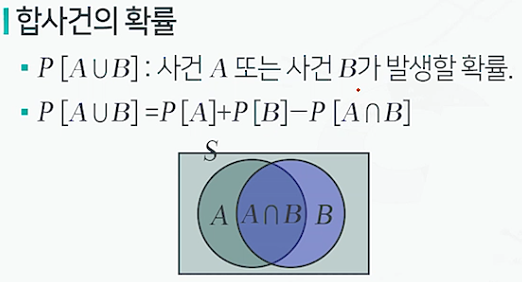
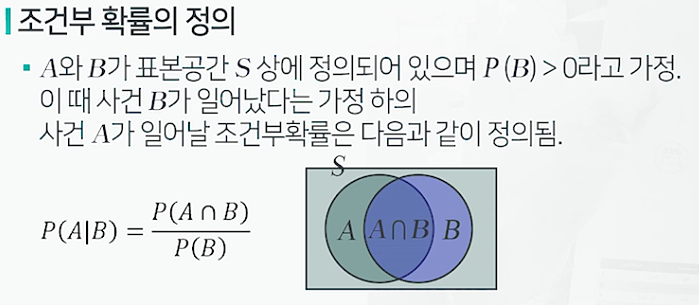
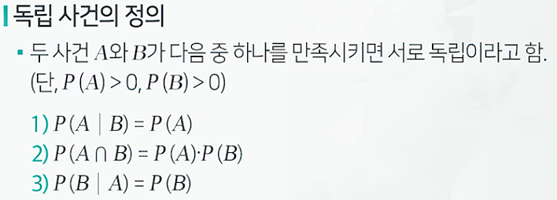

# 확률의 개념과 특징

## 확률 모형

* 시행을 반복할 때마다 나오는 결과가 우연에 의존하여 매번 달라지는 현상 또는 실험(확률실험)에 대한 수리적 모형

### 표본공간

* 확률 실험에서의 모든 관찰 가능한 결과이 집합, S로 표기
* 예)
  * 동전의 앞뒷면 : S={H,T}
  * 주사위의 경우의 수 : S={1,2,3,4,5,6}

### 사건

* 표본공간의 임의의 부분집합,A,B 등으로 표기
* A={2,4,6}
* P[A] = 3/6

### 고전적 접근

* n개의 실험결과로 구성된 표본공간에서 각 실험결과가 일어날 가능성이 같은 경우, m(m=<n)개의 실험결과로 구성된 사건 A의 확률을 아래와 같이 정의함
* P(A) = m/n

### 상대적 비율에 의한 접근

* n번의 반복된 실험 중 어떤 사건 A가 발생한 횟수를 m이라고 할 때, 사건 A의 상대빈도는 m/n으로 구해짐
* 이 실험의 반복 횟수를n을 무한히 증가했을 때, 사건 A의 상대빈도가 수렴하는 값을 사건 A의 확률로 정의하고자 함

### 확률의 공리

1. 임의의 사건 A에 대하여 P(A)>=0
2. P(S) = 1
3. 표본공간 S에 정의된 서로 상호배반인 사건 A1,A2... 에 대하여 P(A1∪A2∪..) = P(A1)+P(A2)...가 성립

### 여사건의 확률

 

### 곱사건의 확률

### 합사건의 확률

### 조건부 확률 정의

### 독립 사건의 정의

