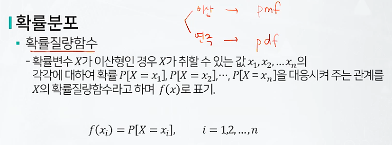
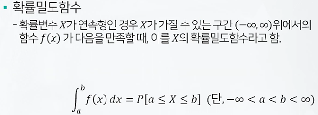
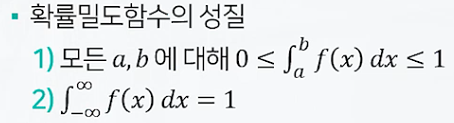
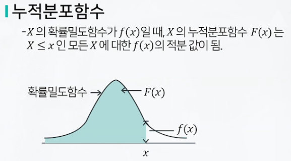
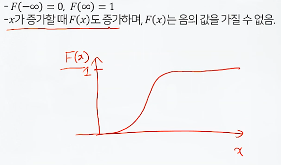
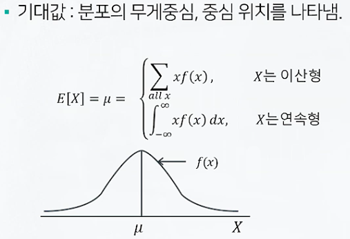
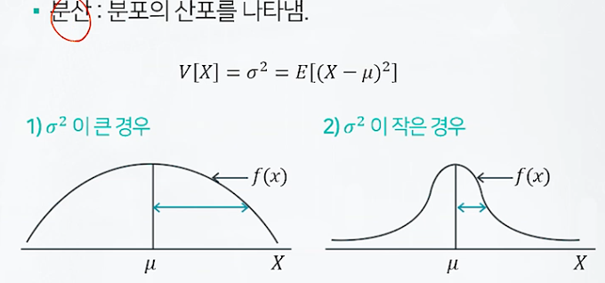
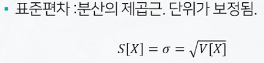

# 확률변수와 확률분포

## 확률변수

표본공간에서 정의된 실수값 함수

* 이산형 확률변수 : 확률변수가 취할 수 있는 값이 셀 수 있는 경우
* 연속형 확률변수 : 주어진 구간에서 모든 실수값을 취할 수 있어 셀 수 없는 경우

### 확률질량함수

### 확률밀도함수

* 확률밀도함수의 성질
* 

## 누적분포함수

## 확률분포의 특성치

