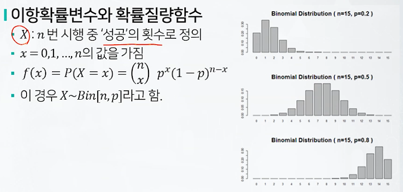
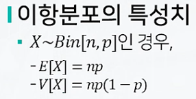
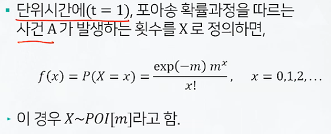
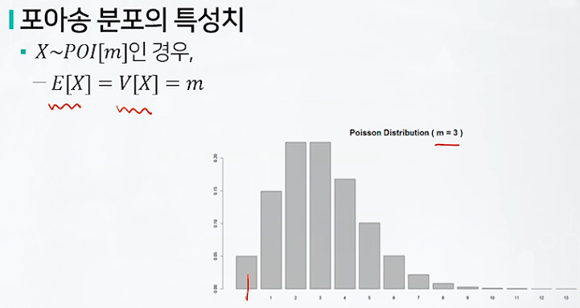
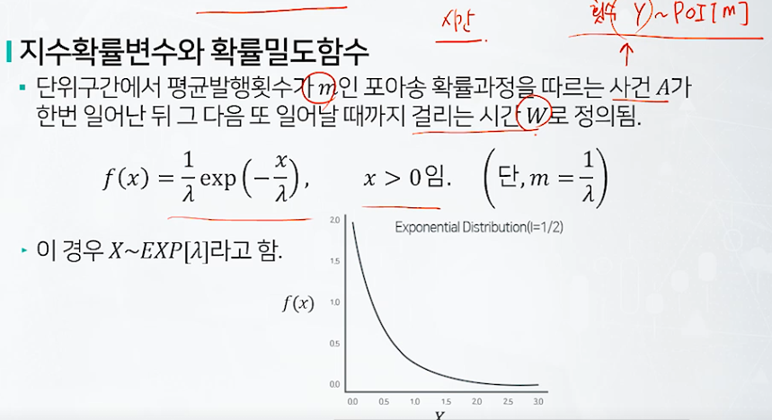
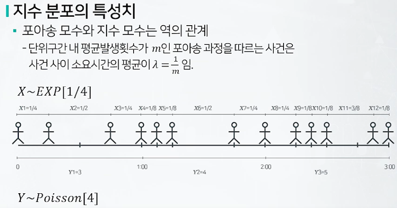
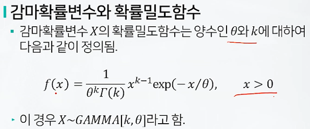
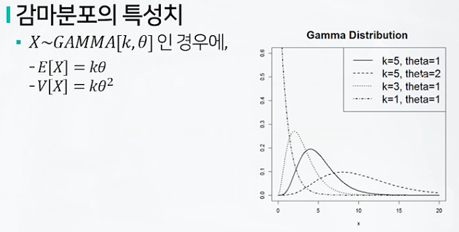

# 확률분포1

## 이항분포

### 베르누이 시행

매 시행마다,

* 성공 또는 실패의 오직 두가지 가능한 결과만 가짐
* 성공의 확률이 p로 일정함

의 조건을 만족하는 실험

### 이항 확률변수가 고려되는 실험

매 시행마다,

* 성공 또는 실패의 오직 두가지 가능한 결과만 가짐
* 성공의 확률이 p로 일정함

의 조건을 만족하는 베르누이 시행을

* 독립적으로
* n번 반복하는 실험

### 이항확률변수와 확률질량함수

### 이항분포의 특성치

## 포아송분포

### 포아송 확률변수와 확률질량함수

### 포아송 분포의 특성치

## 지수분포

### 지수확률변수와 확률밀도함수

### 지수분포의 특성치

## 감마분포

### 감마확률변수와 확률밀도함수

### 감마분포의 특성치

