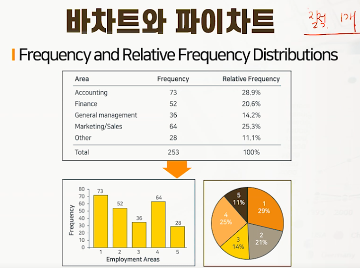
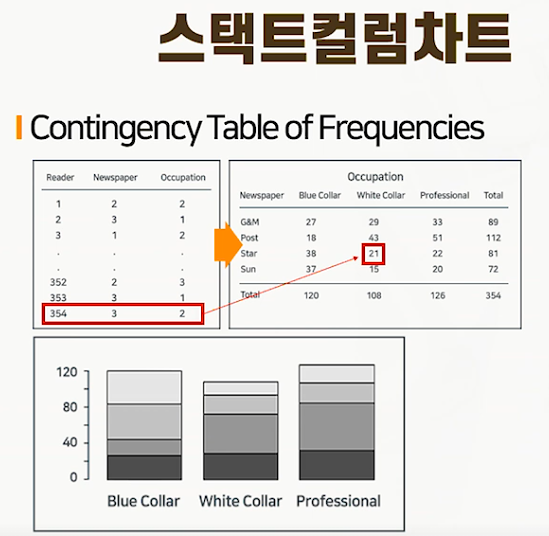
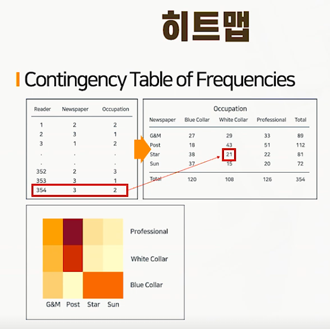
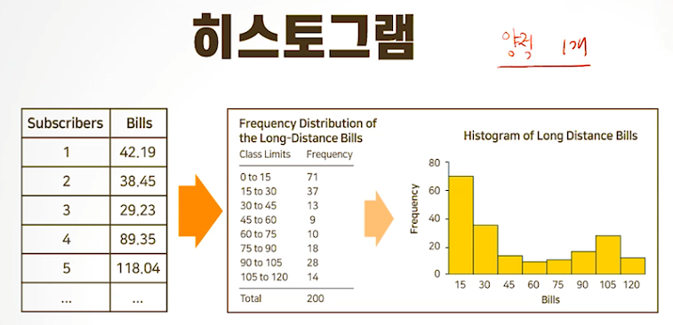
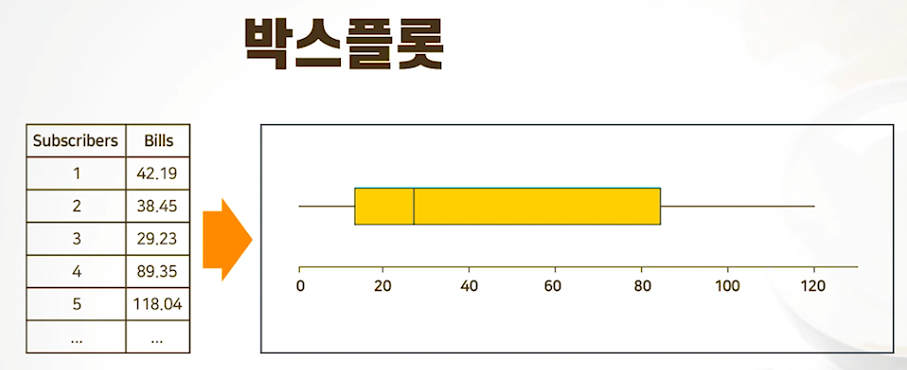
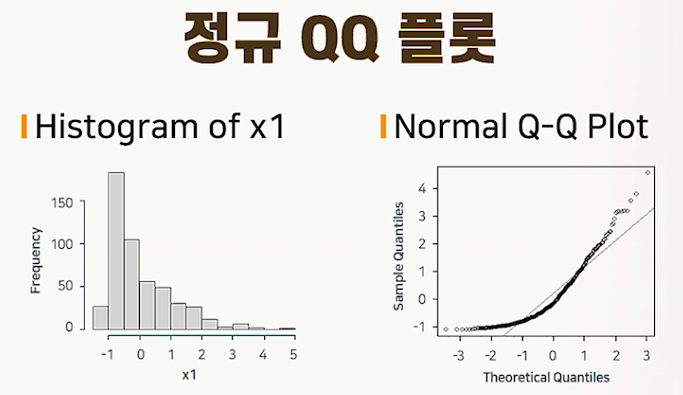
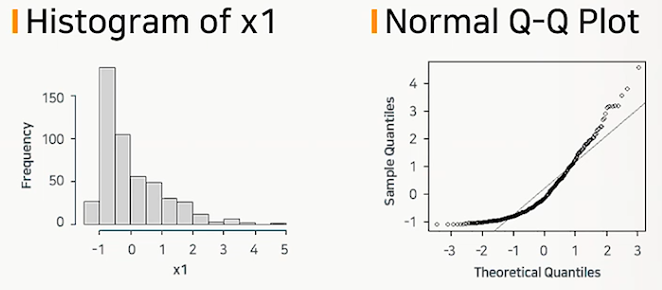
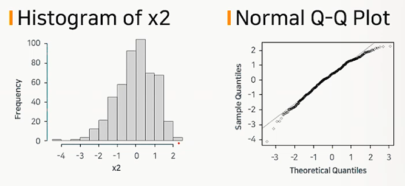
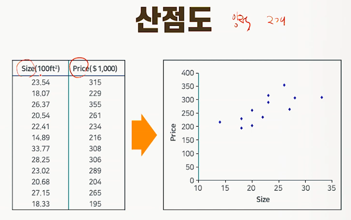

# 그래프에 의한 기술통계

## 데이터 시각화 개요

### 그래프를 이용한 자료의 정리

* 자료의 유형에 맞는 그래프를 이용하여 한눈에 알아볼 수 있게 자료를 시각화할 수 있음

### 질적 자료인 경우

* 1개 변수 : 바차트(막대그림), 파이차트
* 2개 변수  : 히트맵, 스택드컬럼차트

### 양적 자료인 경우

* 1개 변수 : 히스토그램, 박스플롯, 라인차트, qq플롯
* 2개 변수 : 산점도

