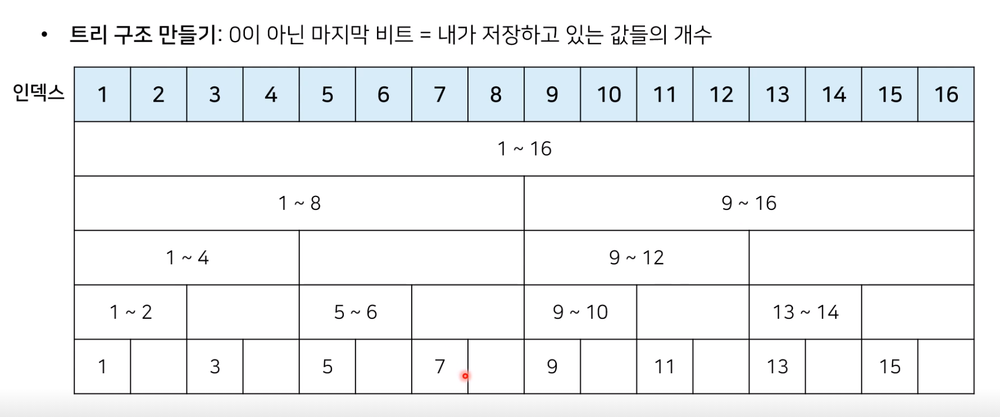

# BIT (바이너리 인덱스 트리 or 펜윅 트리)

* 참고 사이트 : www.acmicpc.net/problem/2042
* 2진법 인덱스 구조를 활용해 구간 합 문제를 효과적으로 해결해 줄 수 있는 자료구조




## python 코드

```python
import sys
input = sys.stdin.readline()

#데이터의 개수(n), 변경 횟수(m), 구간합 계산 횟수(k)
n, m, k = map(int, input().split())

#전체 데이터의 개수는 최대 1,000,000개
arr = [0]*(n+1)
tree = [0]*(n+1)

#i번째 수까지의 누적 합을 계산하는 함수
def prefix_sum(i):
    result = 0
    while i>0:
        result += tree[i]
        #0이 아닌 마지막 비트만큼 빼가면서 이동
        i -= (i&-i)
    return result

#i번째 수를 dif만큼 더하는 함수
def update(i, dif):
    while i<= n:
        tree[i] += dif
        i+= (i&-i)

#start부터 end까지의 구간 합을 계산하는 함수
def interval_sum(start, end):
    return prefix_sum(end) - prefix_sum(start-1)

for i in range(1, n+1):
    x = int(input())
    arr[i] = x
    update(i, x)

for i in range(m+k):
    a,b,c = map(int, input().split())
    #업데이트 연산인 경우
    if a == 1:
        update(b, c -arr[b]) #바뀐 크기(dif)만큼 적용
        arr[b] = c
    #구간 합(interval sum) 연산의 경우
    else:
        print(interval_sum(b,c))
```


참고 코드 : PythonStudy/00_SideStudy/01_Algorithm/04_BIT.py