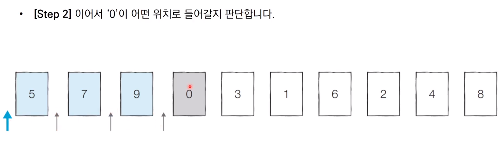

# sort (정렬)

* **정렬**이란 <u>데이터를 특정한 기준에 따라 순서대로 나열</u>하는 것을 말함


## 선택 정렬

* 처리되지 않은 데이터 중에서 가장 작은 데이터를 선택해 맨 앞에 있는 데이터와 바꾸는 것을 반복


### 선택 정렬 동작 예시


### python 코드

```python
#선택 정렬 : 시간 복잡도 O(N^2)
array = [7,5,9,0,3,1,6,2,4,8]

for i in range(len(array)):
    min_index = i #가장 작은 원소의 인덱스
    for j in range(i+1, len(array)):
        if array[min_index]>array[j]:
            min_index = j
    array[i], array[min_index] = array[min_index], array[i] #스와프

print(array)
```


## 삽입 정렬

* 처리되지 않은 데이터를 하나씩 골라 적절한 위치에 삽입
* 선택정렬에 비해 구현 난이도 높으나 일반적으로 더 효율적


### 삽입 정렬 동작 예시





### python 코드

```python
#삽입 정렬 : 시간 복잡도 O(N^2)
#최선의 경우 O(N) 시간 복잡도 (이미 모두 정렬되어있을 경우)
array = [7,5,9,0,3,1,6,2,4,8]

for i in range(1, len(array)):
    for j in range(i, 0 ,-1): #인덱스 i부터 1까지 1씩 감소하며 반복하는 문법
        if array[j] < array[j-1]: #한칸씩 왼쪽으로 이동
            array[j], array[j-1] = array[j-1], array[j]
        else: #자기보다 작은 데이터를 만나면 그자리에 멈춤
            break

print(array)
```


## 퀵 정렬

* <u>기준데이터를 설정</u>하고 그 **기준보다 큰 데이터와 작은 데이터의 위치를 바꾸는 방법**
* 일반적인 상황에서 가장 많이 사용되는 정렬 알고리즘 중 하나
* 가장 기본적인 퀵 정렬은 **첫번째 데이터를 기준 데이터(Pivot)로 설정**


### 퀵 정렬 동작 예시


### python 코드

#### 일반적인 방식

```python
#quick정렬
array = [5,7,9,0,3,1,6,2,4,8]

def quick_sort(array, start, end):
    if start >= end: #원소가 1개인 경우 종료
        return
    pivot = start #피벗은 첫번째 원소
    left = start +1
    right = end
    while left<=right:
        #피벗보다 큰 데이터를 찾을 때까지 반복
        while(left<=end and array[left] <= array[pivot]):
            left += 1
        while(right>start and array[right]>=array[pivot]):
            right -= 1
        if left>right:
            array[right], array[pivot] = array[pivot], array[right]
        else:
            array[left], array[right] = array[right], array[left]
    #분할 이후 왼쪽 부분과 오른쪽 부분에서 각각 정렬 수행
    quick_sort(array, start, right-1)
    quick_sort(array, right+1, end)

quick_sort(array,0,len(array)-1)
print(array)
```


#### 간결한 코드

```python
#quick정렬 간결한 코드
array = [5,7,9,0,3,1,6,2,4,8]

def quick_sort(array):
    #리스트가 하나 이하의 원소만을 담고 있다면 종료
    if len(array) <= 1:
        return array
    pivot = array[0] #피벗은 첫번째 원소
    tail = array[1:] #피벗을 제외한 리스트

    left_side = [x for x in tail if x <= pivot] #분할된 왼쪽 부분
    right_side = [x for x in tail if x > pivot] #분할된 오른쪽 부분

    #분할 이후 왼쪽 부분과 오른쪽 부분에서 각각 정렬 수행하고 전체 리스트 반환
    return quick_sort(left_side)+[pivot]+quick_sort(right_side)

print(quick_sort(array))
```


## 계수 정렬

* 특정한 조건이 부합할 때만 사용할 수 있지만 **매우 빠르게 동작하는** 정렬 알고리즘
  * 데이터의 크기 범위가 제한되어 정수 형태로 표현할 수 있을 때 사용 가능


### 계수 정렬 동작 예시


### python 코드

```python
#모든 원소의 값이 0보다 크거나 같다고 가정
array = [7,5,9,0,3,1,6,2,9,1,4,8,0,5,2]
#모든 범위를 포함하는 리스트 선언(모든 값은 0으로 초기화)
count = [0] * (max(array)+1)

for i in range(len(array)):
    count[array[i]] += 1 #각 데이터에 해당하는 인덱스의 값 증가
    
for i in range(len(count)): #리스트에 기록된 정렬 정보 확인
    for j in range(count[i]):
        print(i, end = ' ') #띄어쓰기를 구분으로 등장한 횟수만큼 인덱스 출력

#데이터가 0과 999,999개로 단 2개만 존재하는 경우 100만개의 리스트에 자료를 담아야 하기때문에 비효율적
#계수정렬은 동일한 값을 가지는 데이터가 여러개 등장할 때 효과적으로 사용할 수 있음
```


## 정렬 예제

```python
#두 배열 A, B / 두 배열은 N개의 원소로 구성되어 있고 원소는 모두 자연수
#최대 K번 바꿔치기(A와 B의 원소 하나씩 서로 바꿈) 연산 수행
#최종 목표 : A의 모든 원소의 합이 최대가 되어야함
#배열 A의 모든 원소의 합의 최댓값을 출력하는 프로그램 작성

'''
예시)
n=5 k=3
a = [1,2,5,4,3]
b = [5,5,6,6,5]

코드 작성 후
a = [6,6,5,4,5]
b = [3,5,1,2,5]

출력결과
26
'''
'''
입력 조건
첫줄에 n,k가 공백으로 구분
둘째줄에 a의 원소가 공백으로 구분
셋째줄에 b의 원소가 공백으로 구분
'''
n, k = map(int,input('n과 k 입력 : ').split())
a = list(map(int, input('배열 a 입력 : ').split()))
b = list(map(int, input('배열 b 입력 : ').split()))

a.sort()
b.sort(reverse=True)

for i in range(k):
    if a[i] < b[i]:
        a[i], b[i] = b[i], a[i]
    else:
        break
print(a)
print(sum(a))
```


## 정렬 알고리즘 복잡도


