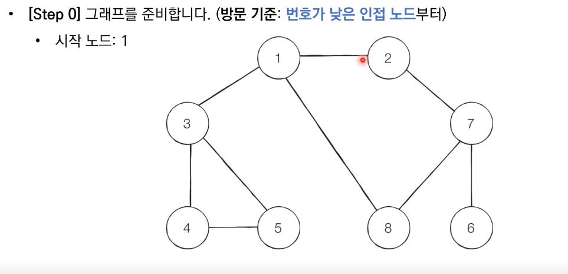
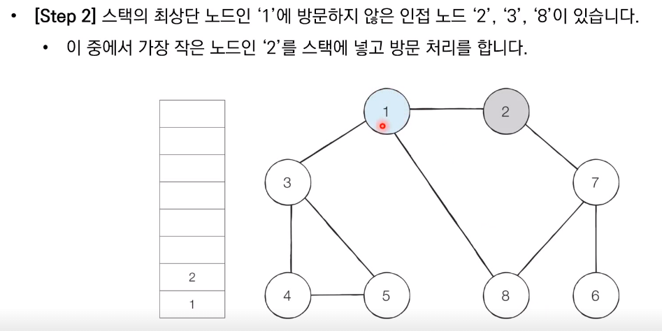
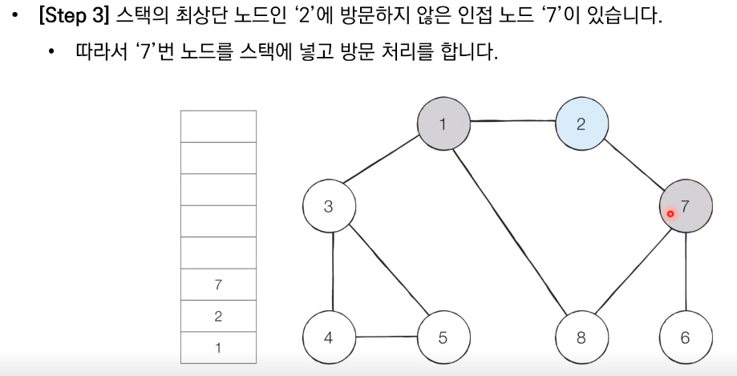
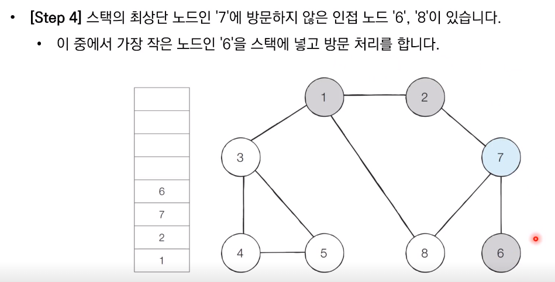
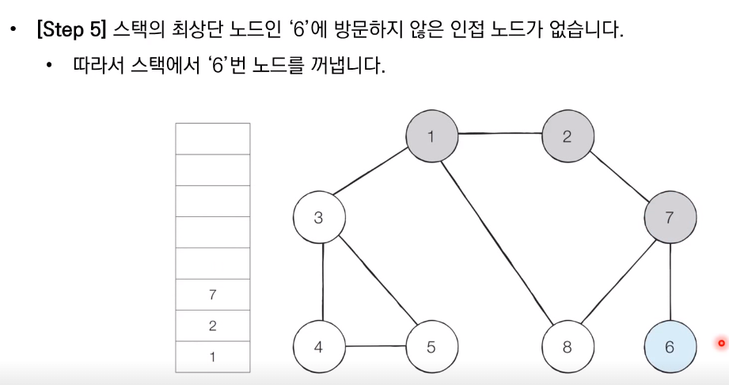
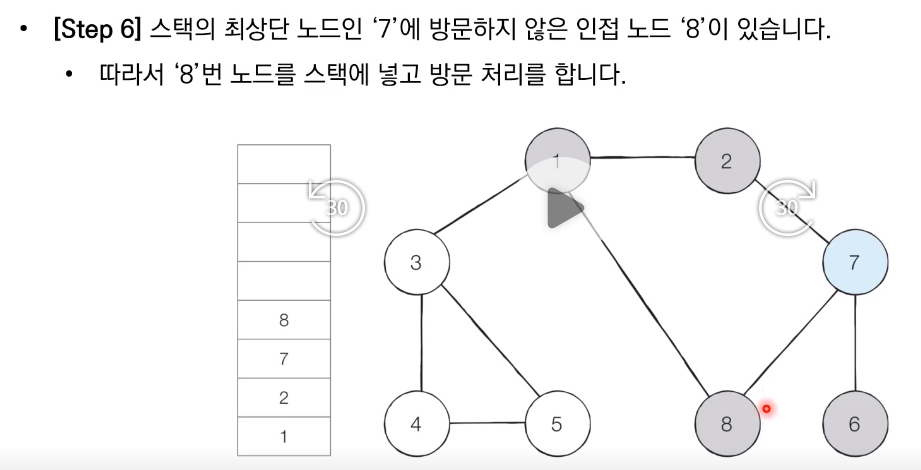
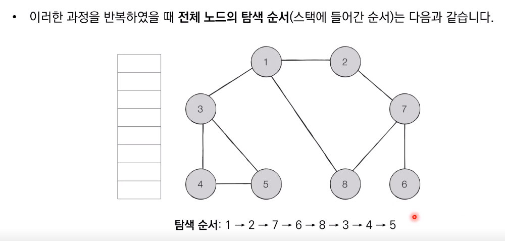

# DFS(Depth-Fisrt Search)

* 깊이 우선 탐색이라고도 부르며 그래프에서 깊은 부분을 우선적으로 탐색하는 알고리즘
* DFS는 스택 자료구조(혹은 재귀함수)를 이용하며, 구체적인 동작 과정은 아래와 같음
  1. 탐색 시작 노드를 스택에 삽입하고 방문 처리를 한다
  2. 스택의 최상단 노드에 방문하지 않은 인접한 노드가 하나라도 있으면 그 노드를 스택에 넣고 방문처리한다. 방문하지 않은 인접노드가 없으면 스택에서 최상단 노드를 꺼낸다
  3. 더 이상 2번의 과정을 수행할 수 없을때까지 반복한다


## DFS 동작 예시
















## python 코드

```python
#DFS메서드 정의
def dfs(graph, v, visited):
    #현재 노드를 방문 처리
    visited[v] = True
    print(v, end=' ')
    #현재 노드와 연결된 다른 노드를 재귀적으로 방문
    for i in graph[v]:
        if not visited[i]:
            dfs(graph, i, visited)

#각 노드가 연결된 정보를 표현(2차원 리스트)
graph = [
    [],
    [2,3,8],
    [1,7],
    [1,4,5],
    [3,5],
    [3,4],
    [7],
    [2,6,8],
    [1,7]
]

#각 노드가 방문된 정보를 표현(1차원 리스트)
visited = [False]*9

#정의된 DFS 함수 호출
dfs(graph, 1, visited)
```

