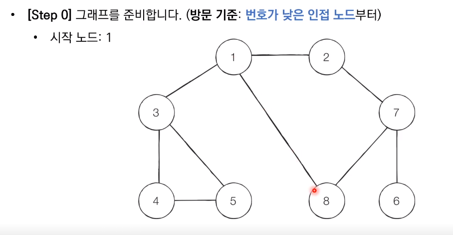
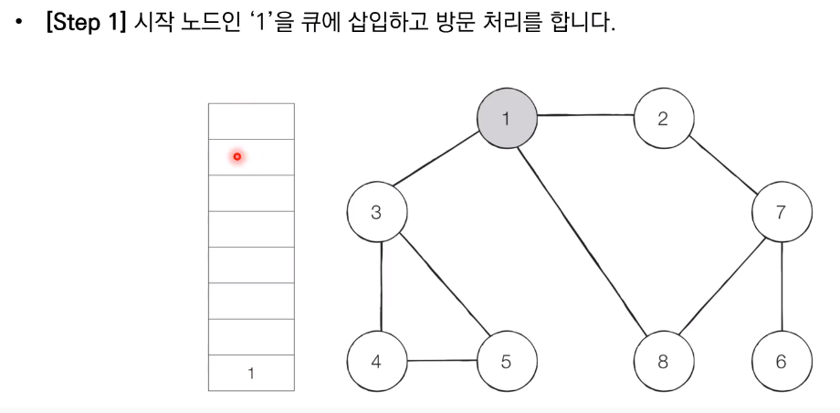
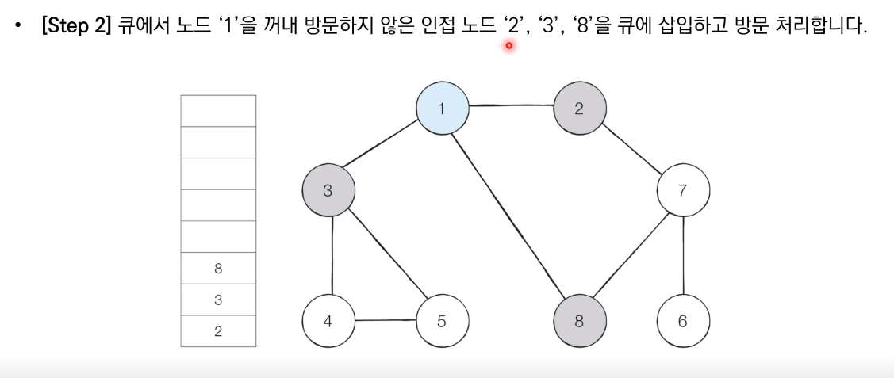
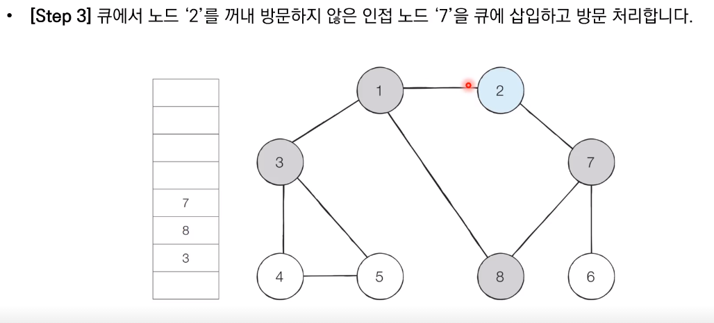
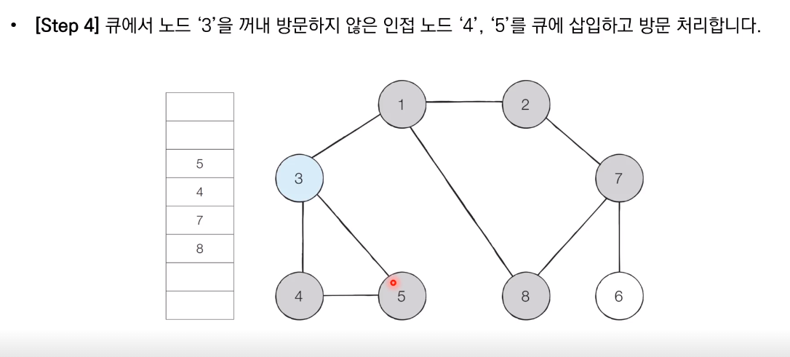
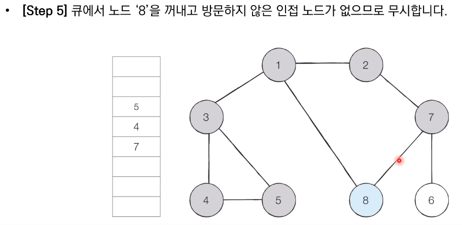
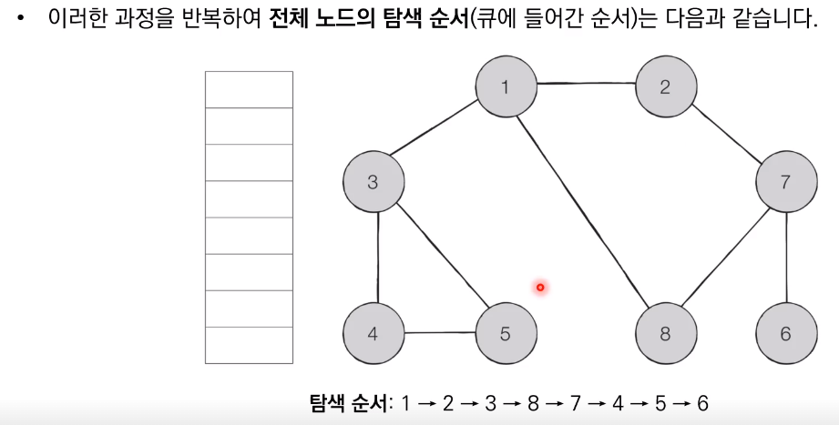

# BFS(Breadth-First Search)

* 너비 우선 탐색이라고도 부르며, 그래프에서 가까운 노드부터 우선적으로 탐색하는 알고리즘
* BFS는 큐 자료구조를 이용하며, 구체적인 동작 과정은 아래와 같음
  1. 탐색 시작 노드를 큐에 삽입하고 방문 처리를 한다
  2. 큐에서 노드를 꺼낸 뒤에 해당 노드의 인접 노드 중에서 방문하지 않은 노드를 모두 큐에 삽입하고 방문 처리한다
  3. 더 이상 2번의 과정을 수행할 수 없을 때까지 반복한다


## BFS 동작 예시
















## python 코드

```python
#BFS(너비 우선 탐색) : 그래프에서 가까운 노드부터 우선적으로 탐색하는 알고리즘
from collections import deque

#BFS메서드 정의
def bfs(graph, start, visited):
    #큐 구현을 위해 deque 라이브러리 사용
    queue = deque([start])
    #현재 노드를 방문처리
    visited[start] = True
    #큐가 빌 때까지 반복
    while queue:
        #큐에서 하나의 원소를 뽑아 출력하기
        v = queue.popleft()
        print(v, end = ' ')
        #아직 방문하지 않은 인접한 원소들을 큐에 삽입
        for i in graph[v]:
            if not visited[i]:
                queue.append(i)
                visited[i] = True

#각 노드가 연결된 정보를 표현(2차원 리스트)
graph = [
    [],
    [2,3,8],
    [1,7],
    [1,4,5],
    [3,5],
    [3,4],
    [7],
    [2,6,8],
    [1,7]
]

#각 노드가 방문된 정보를 표현(1차원 리스트)
visited = [False]*9

#정의된 BFS 함수 호출
bfs(graph, 1, visited)
```

