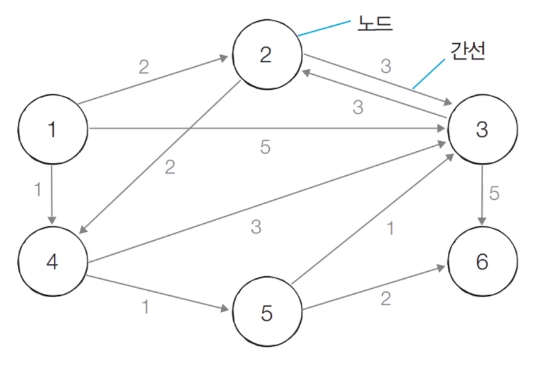
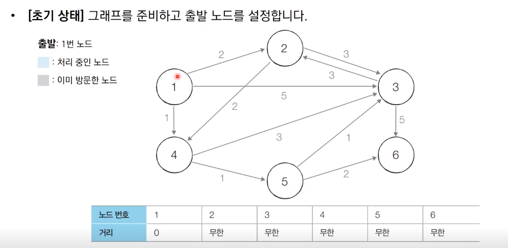
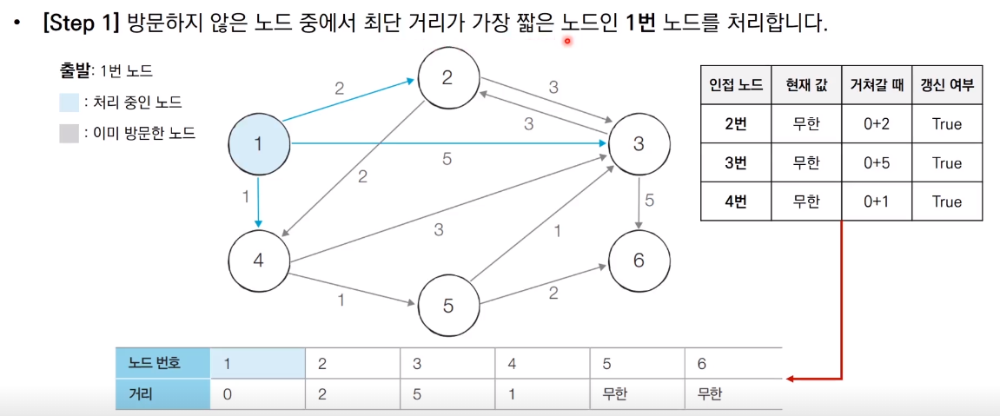
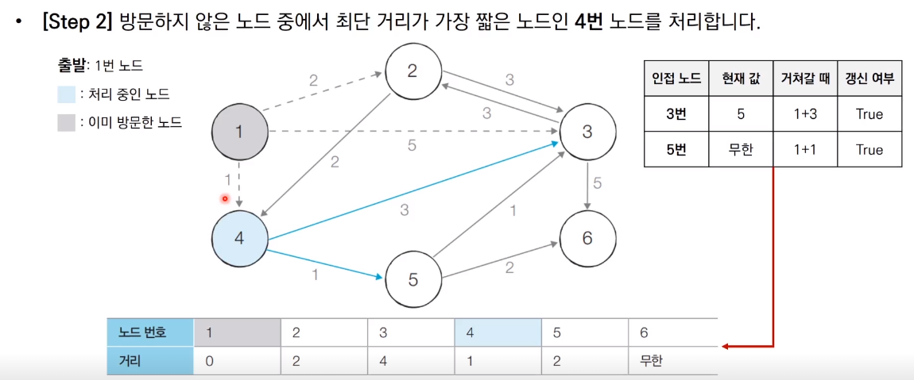
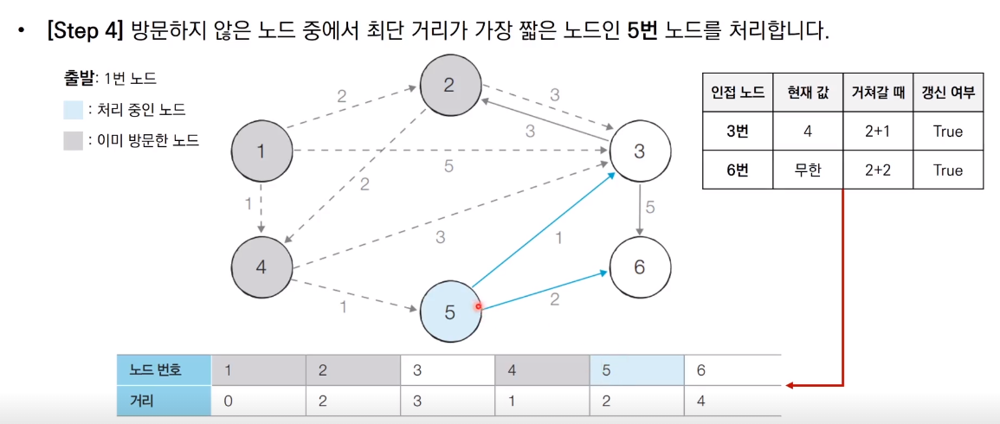
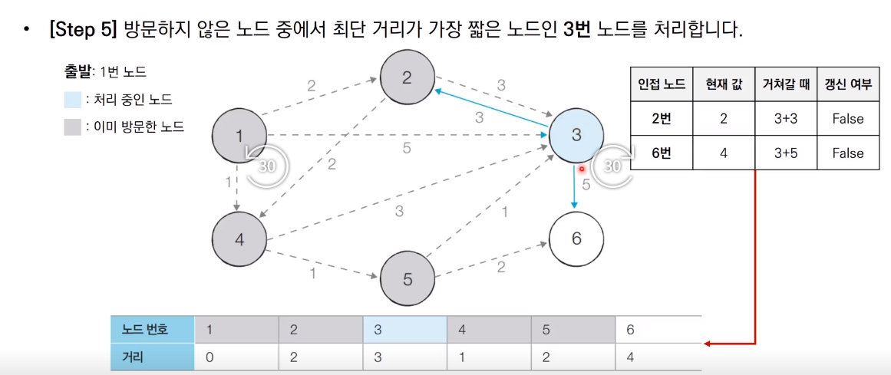
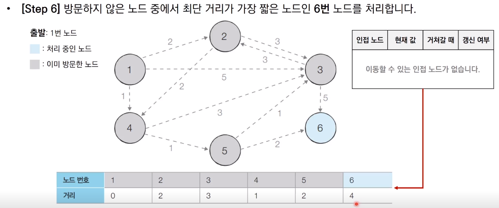

# 다익스트라 최단 경로 알고리즘

* 가장 짧은 경로를 찾는 알고리즘
* 각 지점은 그래프에서 노드로 표현
* 지점 간 연결된 도로는 그래프에서 간선으로 표현




## 동작 과정


1. 출발 노드 설정
2. 최단 거리 테이블 초기화
3. 방문하지 않은 노드중 최단 거리가 가장 짧은 노드 선택
4. 해당 노드를 거쳐 다른 노드로 가는 비용을 계산하여 최단거리 테이블 갱신
5. 위 과정에서 3번과 4번을 반복


## 동작 과정 살펴보기
















## 특징

* 그리디 알고리즘 : 매 상황에서 방문하지 않은 가장 비용이 적은 노드를 선택해 임의의 과정을 반복
* 단계를 거치며 한 번 처리된 노드의 최단 거리는 고정되어 더 이상 바뀌지 않음
  * 한 단계당 하나의 노드에 대한 최단 거리를 확실히 찾는것으로 이해할 수 있음
* 다익스트라 알고리즘을 수행한 뒤에 <u>테이블에 각 노드까지의 최단 거리 정보가 저장됨</u>
  * 완벽한 형태의 최단 경로를 구하려면 소스코드에 추가적인 기능을 더 넣어야 함


## 간단한 구현 방법

```python
#다익스트라 최단 경로 알고리즘
import sys
input = sys.stdin.readline
INF = int(1e9) #무한을 의미하는 값으로 10억을 설정

#노드의 개수, 간선의 개수를 입력받기
n, m = map(int, input().split())
#시작노드 번호를 입력받기
start = int(input())
#각 노드에 연결되어 있는 노드에 대한 정보를 담는 리스트를 만들기
graph = [[] for i in range(n+1)]
#방문한 적이 있는지 체크하는 목적의 리스트 만들기
visited = [False]*(n+1)
#최단 거리 테이블을 모두 무한으로 초기화
distance = [INF] * (n+1)

#모든 간선 정보를 입력받기
for _ in range(m):
    a, b, c = map(int,input().split())
    #a번 노드에서 b번 노드로 가능 비용이 c라는 의미
    graph[a].append((b,c))

#방문하지 않은 노드 중에서, 가장 최단거리가 짧은 노드의 번호를 반환
def get_smallest_node():
    min_value = INF
    index = 0 #가장 최단거리가 짧은 노드(인덱스)
    for i in range(1, n+1):
        if distance[i] < min_value and not visited[i]:
            min_value = distance[i]
            index = i
    return index

def dijkstra(start):
    #시작 노드에 대해서 초기화
    distance[start] = 0
    visited[start] = True
    for j in graph[start]:
        distance[j[0]] = j[1]
    #시작 노드를 제외한 전체 n-1개의 노드에 대해 반복
    for i in range(n-1):
        #현재 최단 거리가 가장 짧은 노드를 꺼내서 방문처리
        now = get_smallest_node()
        visited[now] = True
        #현재 노드와 연결된 다른 노드를 확인
        for j in graph[now]:
            cost = distance[now] + j[i]
            #현재 노드를 거쳐서 다른 노드로 이동하는 거리가 더 짧은 경우
            if cost < distance[j[0]]:
                distance[j[0]] = cost

#다익스트라 알고리즘을 수행
dijkstra(start)

#모든 노드로 가기 위한 최단 거리를 출력
for i in range(1, n+1):
    #도달할 수 없는 경우, 무한이라고 출력
    if distance[i] == INF:
        print("INFINITY")
    #도달할 수 있는 경우 거리를 출력
    else:
        print(distance[i])
```

