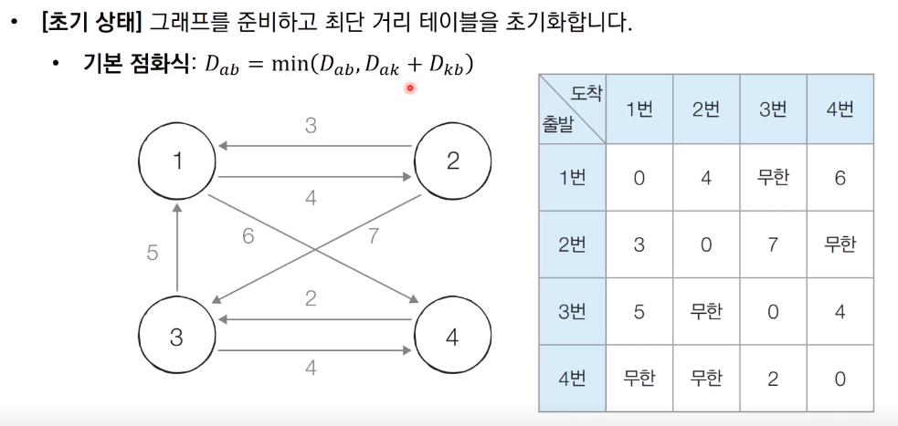
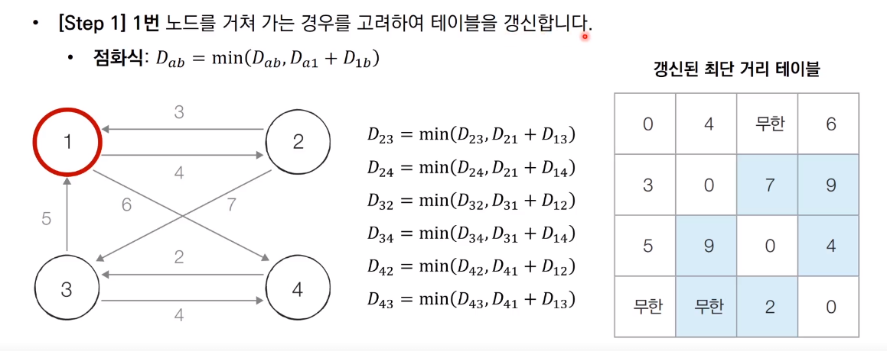
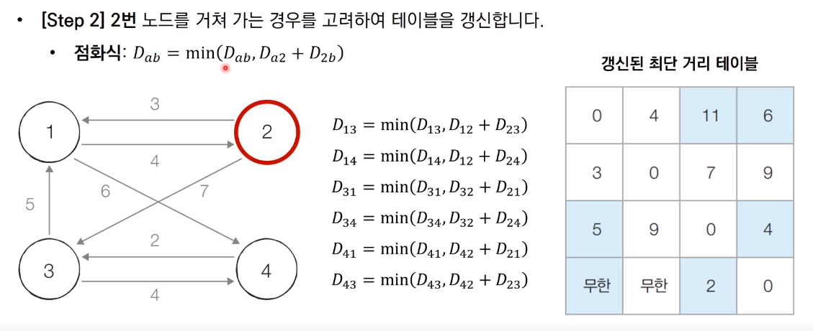
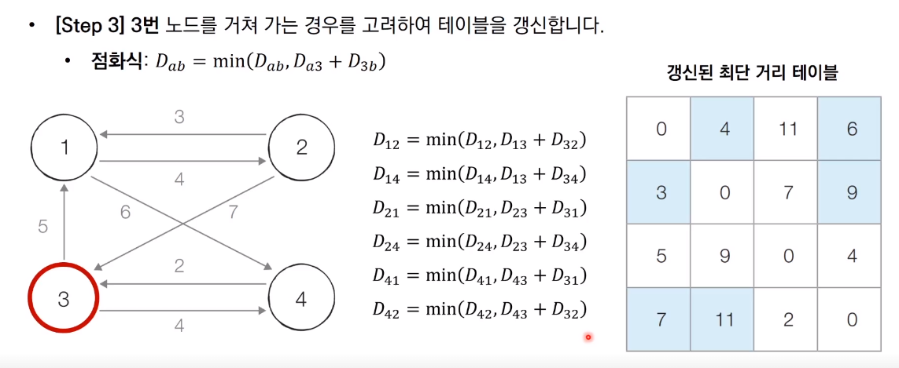
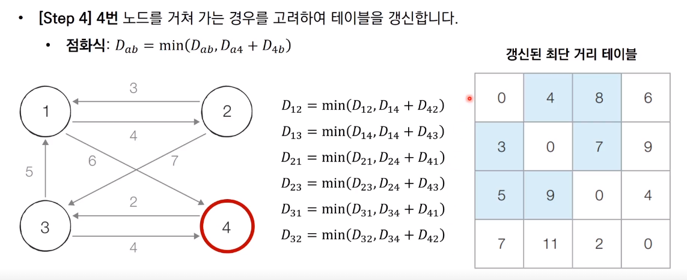

# Floyd_Warshall 알고리즘

* 모든 노드에서 다른 모든 노드까지의 최단 경로를 모두 계산한다
* 플로이드 워셜 알고리즘은 다익스트라 알고리즘과 마찬가지로 단계별로 거쳐 가는 노드를 기준으로 알고리즘을 수행한다
  * 다만 매 단계마다 방문하지 않은 노드 중에 최단 거리를 갖는 노드를 찾는 과정이 필요하지 않다
* 플로이드 워셜은 2차원 테이블에 최단 거리 정보를 저장한다
* 플로이드 워셜 알고리즘은 다이나믹 프로그래밍 유형에 속한다
* 각 단계마다 특정한 노드 k를 거쳐 가는 경우를 확인한다
  * a에서 b로 가는 최단 거리보다 a에서 k를 거쳐 b로 가는 거리가 더 짧은지 검사한다

## 플로이드 워셜 알고리즘 동작 과정

참고 코드 : PythonStudy/00_SideStudy/01_Algorithm/14_Floyd_Warshall.py
