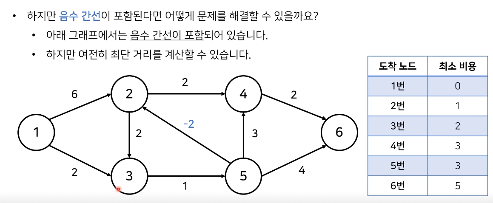

# Bellman Ford

* 비용이 음수인 간선이 있을 때 최단 경로를 구하는 법
* 
  1. 출발 노드를 설정한다
  2. 최단 거리 테이블을 초기화한다
  3. 다음의 과정을 N-1번 반복한다
     1. 전체 간선 E개를 하나씩 확인한다
     2. 각 간선을 거쳐 다른 노드로 가는 비용을 계산하여 최단 거리 테이블을 갱신한다
* 만약 음수 간선 순환이 발생하는지 체크하고 싶다면 3번의 과정을 한 번 더 수행한다
  * 이때 최단 거리 테이블이 갱신된다면 음수 간선 순환이 존재하는 것이다

