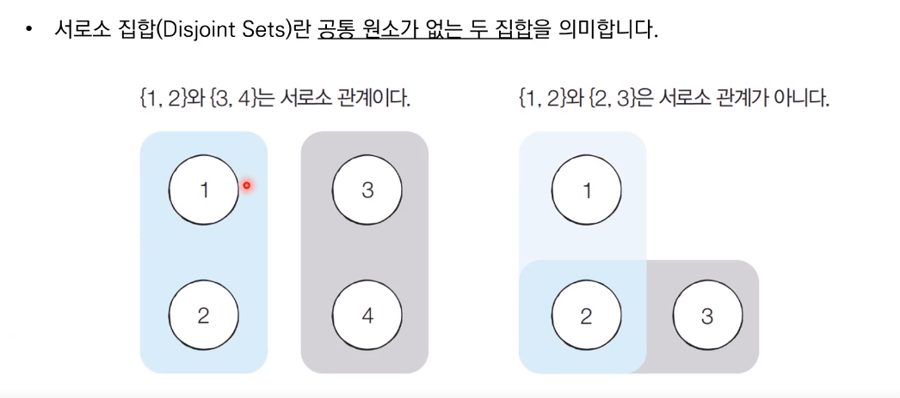

##서로소 집합 자료 구조



* 서로소 부분 집합들로 나누어진 원소들의 데이터를 처리하기 위한 자료 구조
* 서로소 집합 자료구조는 두 종류의 연산을 지원
  * 합집합(Union) : 두개의 원소가 포함된 집합을 하나의 집합으로 합치는 연산
  * 찾기(Find) : 특정한 원소가 속한 집합이 어떤 집합인지 알려주는 연산
* 서로소 집합 자료구조는 **합치기 찾기(Union Finde) 자료구조**라고 불리기도 함

------

* 여러개의 합치기 연산이 주어졌을 때 서로소 집합 자료구조의 동작 과정은 다음과 같다
  1. 합집합 연산을 확인하여, 서로 연결된 두 노드 A,B을 확인
     1. A와 B의 루트 노드 A', B'을 각각 찾는다
     2. A'을 B'의 부모 노드로 설정한다
  2. 모든 합집합 연산을 처리할 때까지 1번의 과정을 반복한다


## 서로소 집합 자료구조 동작 과정


## 서로소 집합 자료구조 : 연결성

* 기본적인 형태의 서로소 집합 자료구조에서는 루트 노드에 즉시 접근할 수 없다
  * 루트 노드를 찾기 위해 부모 테이블을 계속해서 확인하며 거슬러 올라가야 한다
* 다음 예시에서 노드 3의 루트를 찾기 위해서는 노드 2를 거쳐 노드 1에 접근해야 한다


## 서로소 집합 자료구조 : 기본적인 구현 방법의 문제점

* 합집합 연산이 편향되게 이루어지는 경우 찾기 함수가 비효율적으로 동작
* 최악의 경우에는 찾기 함수가 모든 노드를 다 확인하게 되어 시간 복잡도가 O(V)가 됨
  * 다음과 같이 {1,2,3,4,5}의 총 5개의 원소가 존재하는 상황
  * 수행된 연산들 : Union(4,5), Union(3,4), Union(2,3), Union(1,2)


## 서로소 집합 자료구조 : 경로 압축

* 찾기 함수를 최적화 하기 위한 방법으로 경로 압축(Path Compression)을 이용할 수 있다
  * 찾기 함수를 재귀적으로 호출한 뒤에 부모 테이블 값을 바로 갱신

```python
#특정 원소가 속한 집합을 찾기
def find_parent(parent, x):
    #루트 노드가 아니라면, 루트 노드를 찾을 때까지 재귀적으로 호출
    if parent[x] != x:
        parent[x] = find_parent(parent, parent[x])
    return parent[x]
```

* 경로 압축 기법을 적용하면 각 노드에 대하여 찾기 함수를 호출한 이후에 해당 노드의 루트 노드가 바로 부모 노드가 됨
* 동일한 예시에 대해서 모든 합집합 함수를 처리한 후 각 원소에 대하여 찾기 함수를 수행하면 다음과 같이 부모 테이블이 갱신됨
* 기본적인 방법에 비하여 시간 복잡도가 개선됨


## 서로소 집합을 활용한 사이클 판별

* 사이클 판별 알고리즘
  1. 각 간선을 하나씩 확인하며 두 노드의 루트 노드를 확인
     1. 루트 노드가 서로 다르다면 두 노드에 대하여 합집합 연산을 수행
     2. 루트 노드가 서로 같다면 사이클이 발생한 것
  2. 그래프에 포함되어 있는 모든 간선에 대하여 1번 과정을 반복


## 동작 과정


참고 코드 : PythonStudy/00_SideStudy/01_Algorithm/16_coprime.py

참고 코드 : PythonStudy/00_SideStudy/01_Algorithm/17_coprime_cycle.py

