# 크루스칼 알고리즘

## 신장 트리

* 그래프에서 모든 노드를 포함하면서 사이클이 존재하지 않는 부분 그래프
  * 모든 노드가 포함되어 서로 연결되면서 사이클이 존재하지 않는다는 조건은 트리의 조건이기도 하다

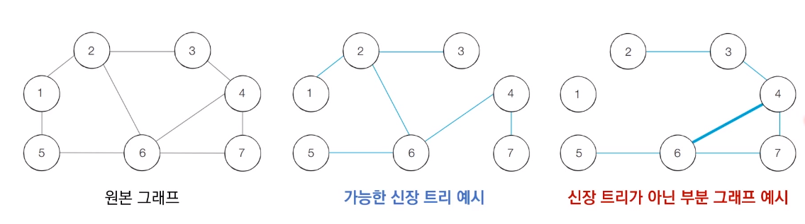

### 최소 신장 트리

* 최소한의 비용으로 구성되는 신장 트리를 찾아야 할 때
* 예를 들어 N개의 도시가 존재하는 상황에서 두 도시 사이에 도로를 놓아 전체 도시가 서로 연결될 수 있게 도로를 설치하는 경우
  * 두 도시 A,B를 선택했을때 A에서 B로 이동하는 경로가 반드시 존재하도록 도로를 설치

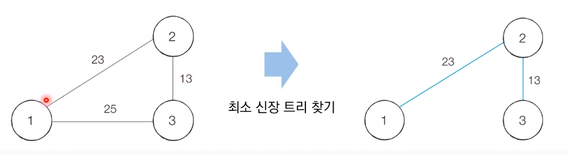

## 크루스칼 알고리즘

* 대표적인 크루스칼 알고리즘
* 그리디 알고리즘으로 분류
* 구체적인 동작과정은 아래와 같음
  1. 간선 데이터를 비용에 따라 오름차순으로 정렬
  2. 간선을  하나씩 확인하며 현재의 간선이 사이클을 발생시키는지 확인
     1. 사이클이 발생하지 않는 경우 최소 신장트리에 포함
     2. 사이클이 발생하는 경우 최소 신장 트리에 포함시키지 않음
  3. 모든 간선에 대하여 2번의 과정을 반복

## 동작 과정

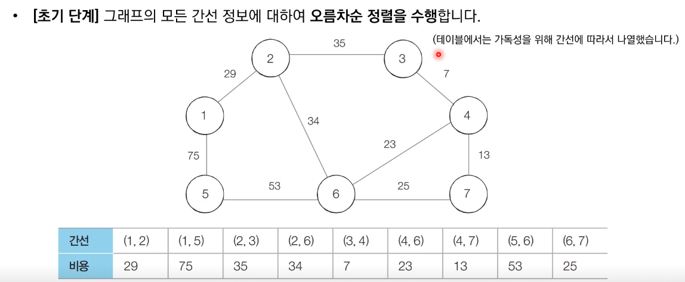

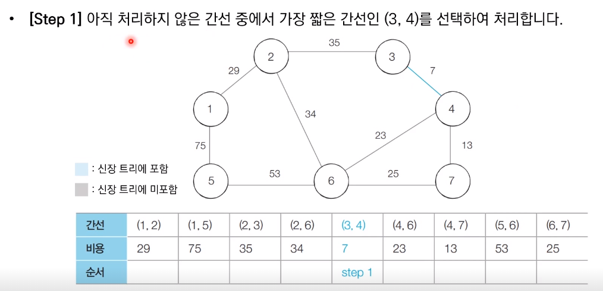

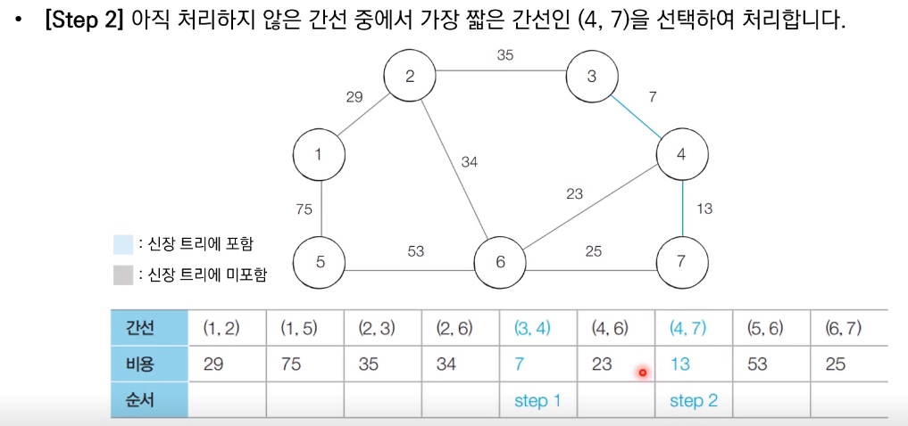

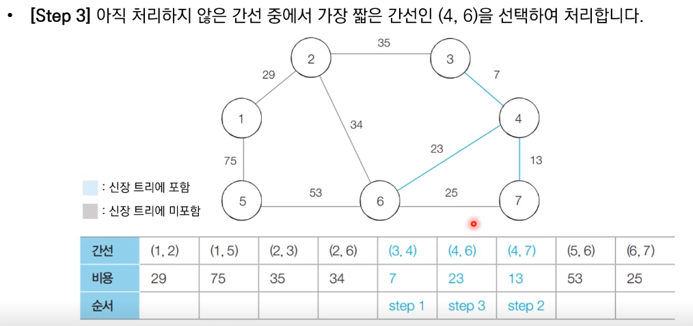

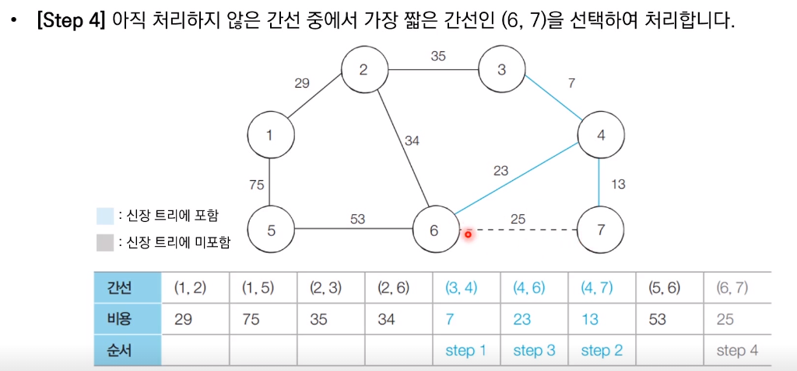

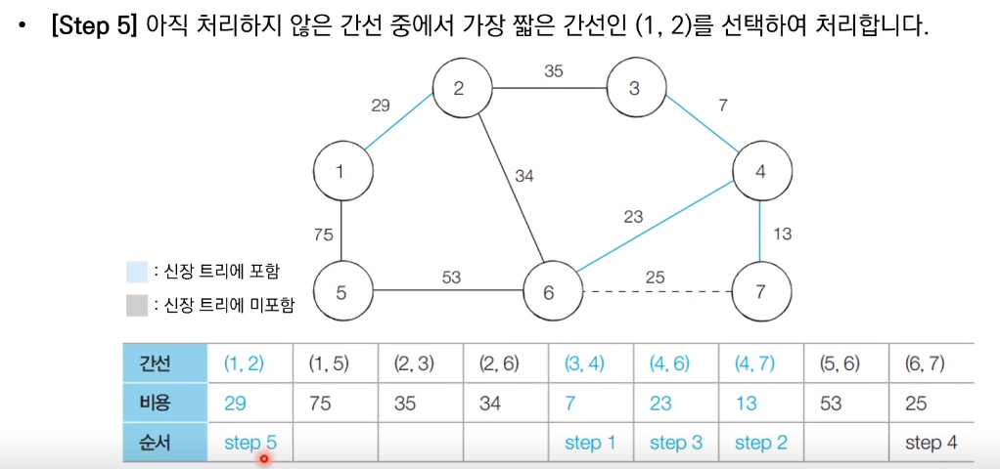

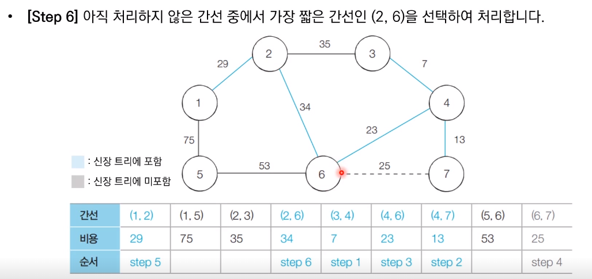

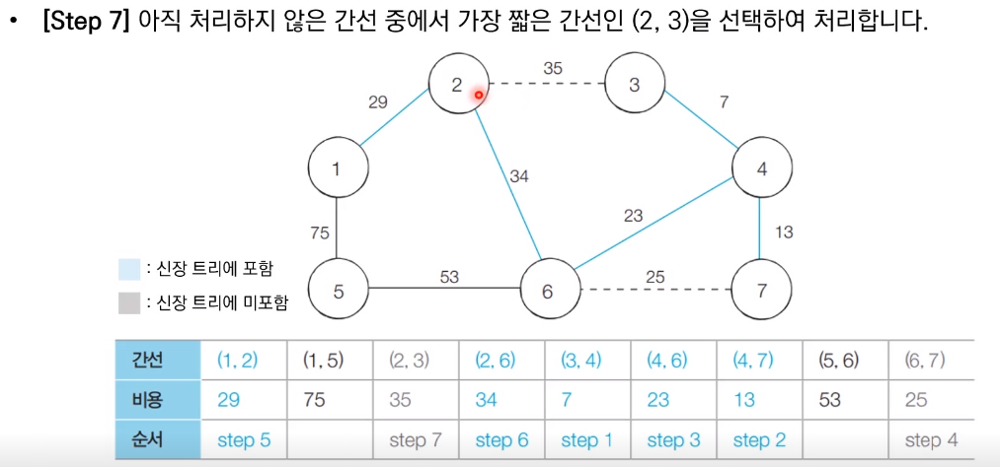

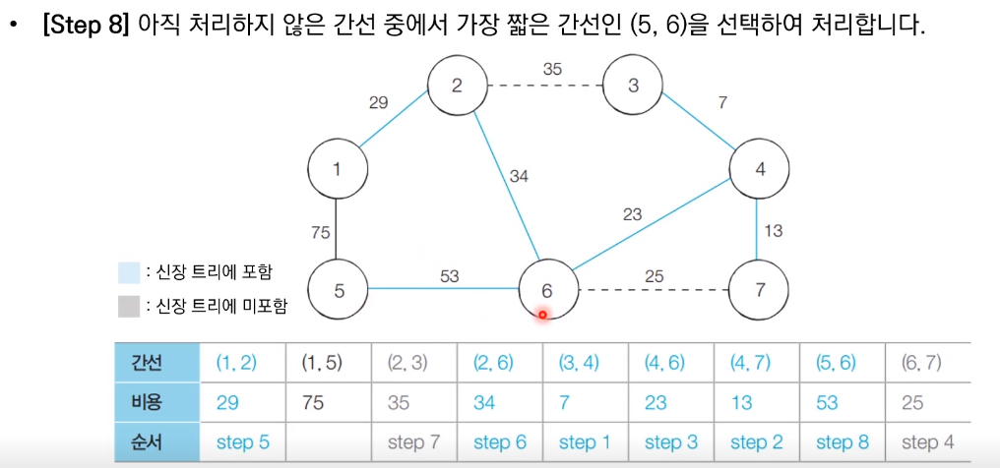

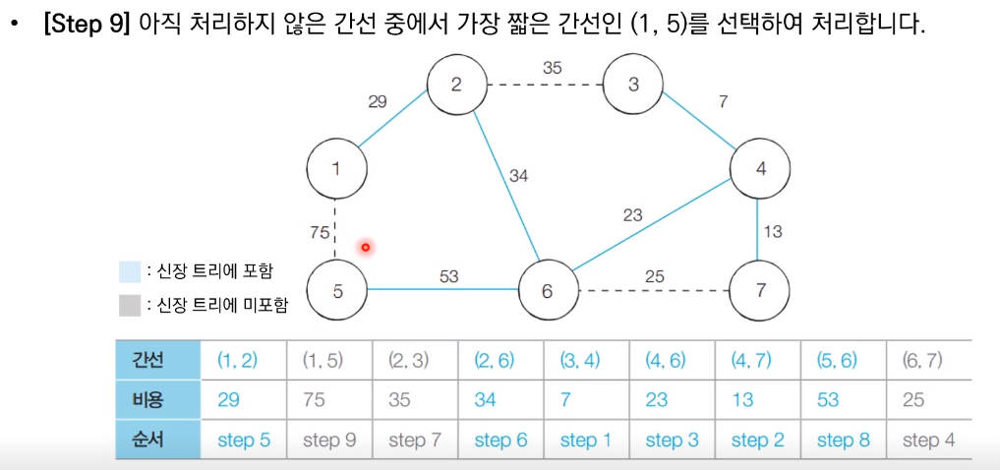

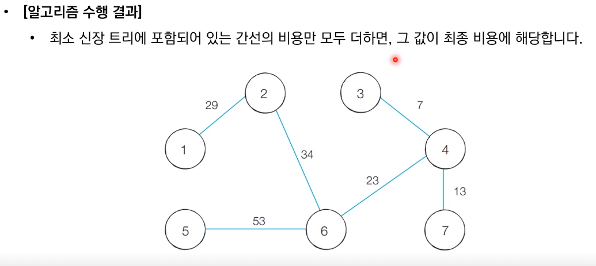

참고 코드 : PythonStudy/00_SideStudy/01_Algorithm/18_Kruscal.py
