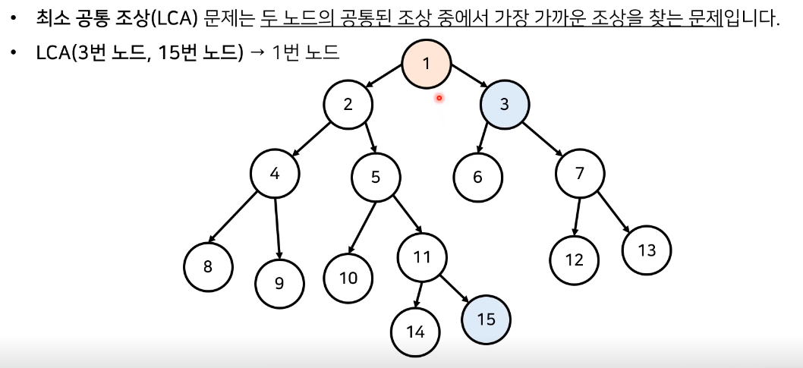
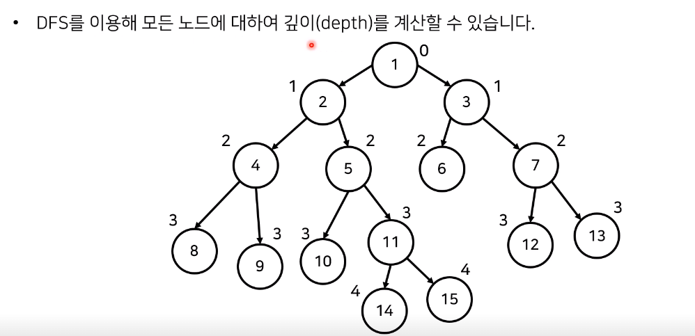
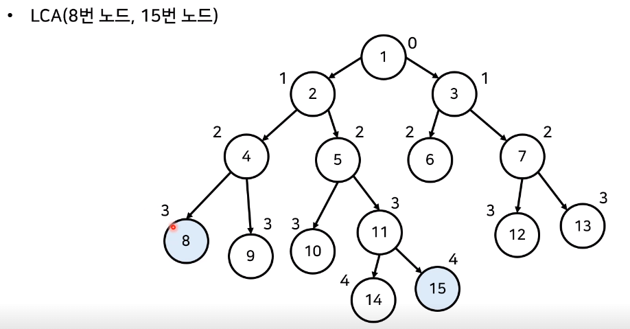
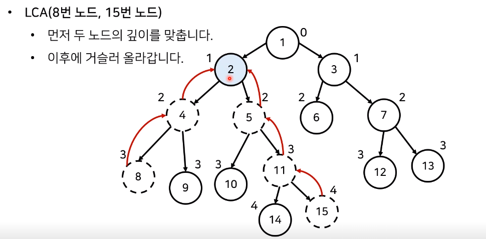
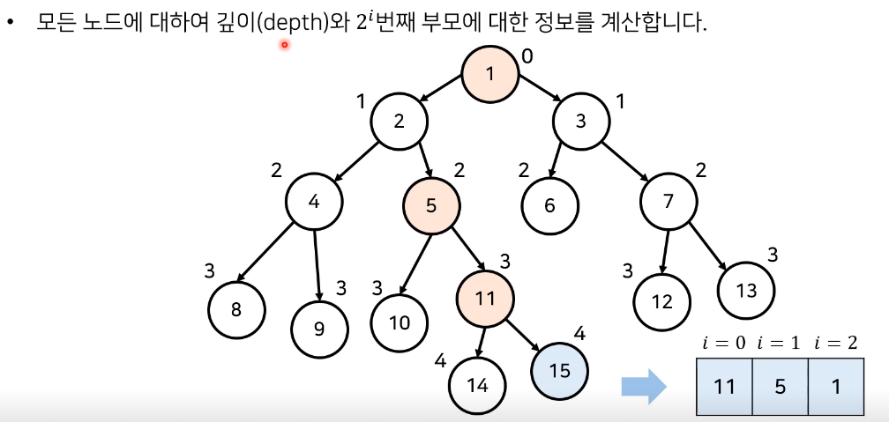
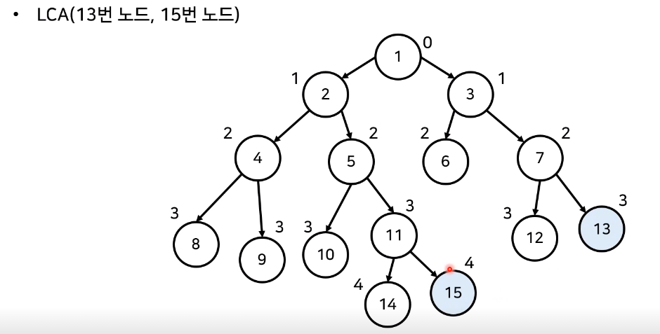
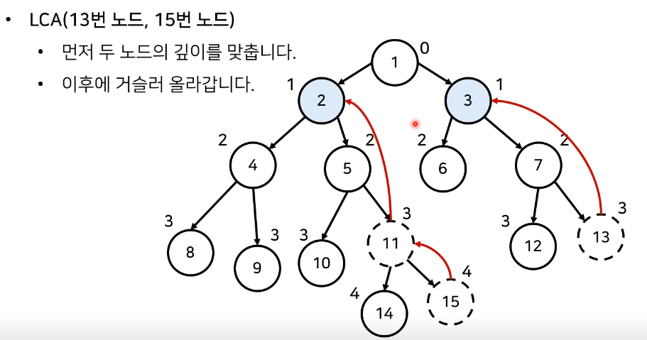
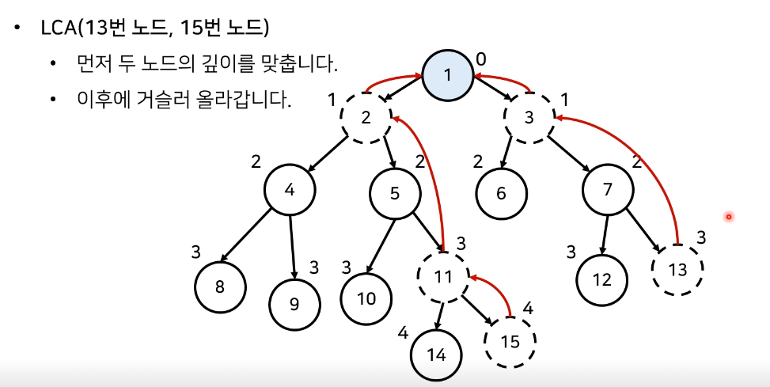

# 최소 공통 조상(Lowest Common Ancestor)

1. 모든 노드에 대한 깊이를 계산
2. 최소 공통 조상을 찾을 두 노드를 확인
   1. 먼저 두 노드의 깊이가 동일하도록 거슬러 올라간다
   2. 이후에 부모가 같아질 때까지 반복적으로 두 노드의 부모 방향으로 거슬러 올라간다
3. 모든 LCA(a,b) 연산에 대하여 2번의 과정을 반복한다

## 연산 과정 살펴보기

## 개선된 최소 공통 조상 알고리즘

* 각 노드가 거슬러 올라가는 속도를 빠르게 만드는 방법
  * 만약 총 15칸 거슬러 올라가야 한다면?
    * 8칸 > 4칸 > 2칸 > 1칸
* 2의 제곱 형태로 거슬러 올라가도록 하면 O(logN)의 시간 복잡도를 보장할 수 있다
* 메모리를 조금 더 사용하여 각 노드에 대하여 2^i번째 부모에 대한 정보를 기록

## 연산 과정 살펴보기

참고 코드 : PythonStudy/00_SideStudy/01_Algorithm/19_LCA.py

참고 코드 : PythonStudy/00_SideStudy/01_Algorithm/20_LCA_2.py
