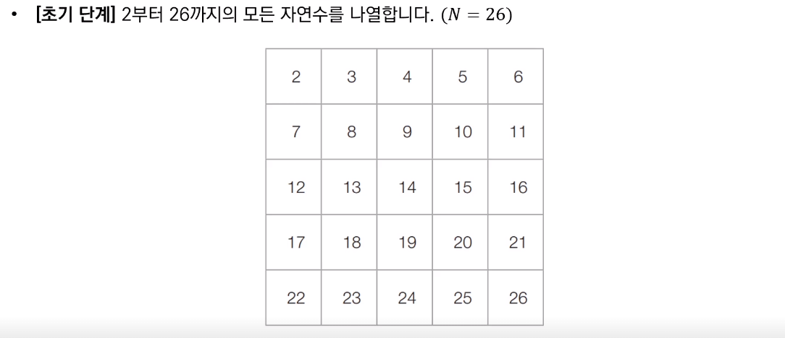
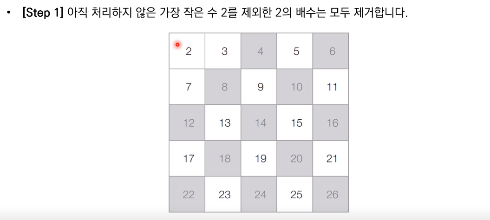
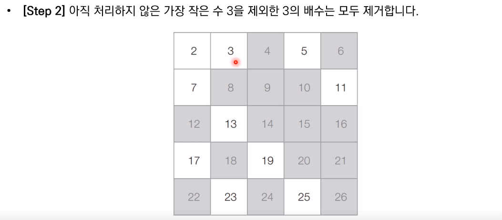
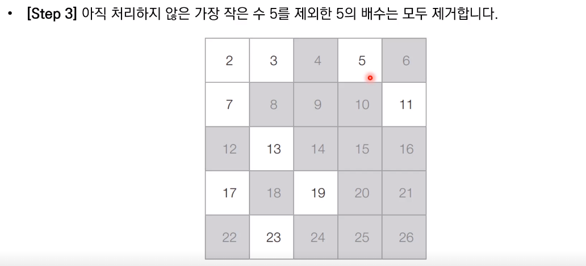
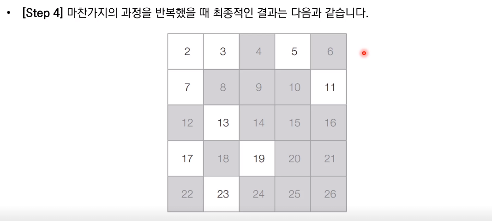

# 소수(Prime Number)

* 소수란 1보다 큰 자연수 중에서 1과 자신을 제외한 자연수로는 나누어 떨어지지 않는 자연수
  * 6은 1,2,3,6으로 나누어 떨어지므로 소수가 아니다
  * 7은 1과 7을 제외하고는 나누어 떨어지지 않으므로 소수이다

```python
#소수 판별 함수
def is_prime_number(x):
    #2부터 (x-1)까지의 모든 수를 확인하며
    for i in range(2,x):
        #x가 해당 수로 나누어 떨어진다면
        if x%i == 0:
            return False # 소수가 아님
    return True #소수임

print(is_prime_number(4))
print(is_prime_number(7))
```


## 약수의 성질

* 모든 약수가 가운데 약수를 기준으로 곱셈 연산에 대해 대칭을 이루는 것을 알 수 있다
  * 예를 들어 16의 약수는 1,2,4,8,16
  * 이때 2X8=16은 8X2=16과 대칭이다
* 따라서 우리는 특정한 자연수의 모든 약수를 찾을 때 가운데 약수(제곱근)까지만 확인하면 된다
  * 예를 들어 16이 2로 나누어 떨어진다는 것은 8로도 나누어 떨어진다는 것을 의미한다

```python
#소수 판별 함수 (개선된 알고리즘)
import math

#소수 판별 함수
def is_prime_number(x):
    #2부터 x의 제곱근까지의 모든 수를 확인하며
    for i in range(2, int(math.sqrt(x)+1)):
        #x가 해당수로 나누어 떨어진다면
        if x%i == 0:
            return False # 소수가 아님
    return True #소수임

print(is_prime_number(4))
print(is_prime_number(7))
```


## 다수의 소수 판별

* 특정한 수의 범위 안에 존재하는 모든 소수를 찾아내야 한다면?
  * 에라토스테네스의 체 알고리즘 사용

* 다수의 자연수에 대하여 소수 여부를 판별할 때 사용하는 대표적인 알고리즘
* N보다 작거나 같은 모든 소수를 찾을 때 사용 가능
* 동작과정은 아래와 같음
  1. 2부터 N까지의 모든 자연수를 나열
  2. 남은 수 중에서 아직 처리하지 않은 가장 작은 수 i를 찾는다
  3. 남은 수 중에서 i의 배수를 모두 제거한다(i는 제거하지 않는다)
  4. 더 이상 반복할 수 없을 때까지 2번과 3번의 과정을 반복한다

### 동작 과정












참고 코드 : PythonStudy/00_SideStudy/01_Algorithm/23_prime_number.py
