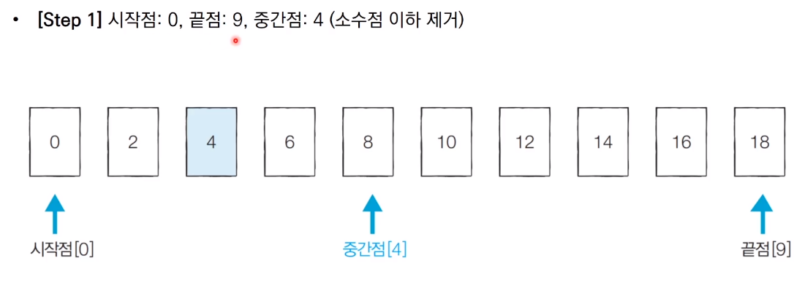

# 이진 탐색 알고리즘

* 순차 탐색 : 리스트안에 있는 특정한 데이터를 찾기 위해 앞에서부터 데이터를 하나씩 확인하는 방법
* 이진 탐색 : 정렬되어 있는 리스트에서 탐색 범위를 절반씩 좁혀가며 데이터를 탐색하는 방법
  * 이진 탐색은 시작점, 끝점, 중간점을 이용하여 탐색 범위를 설정

## 이진 탐색 동작 예시





## 파이썬 이진 탐색 라이브러리

* `bisect_left(a, x)` : 정렬된 순서를 유지하면서 배열 a에 x를 삽입할 가장 왼쪽 인덱스를 반환
* `bisect_right(a, x)` : 정렬된 순서를 유지하면서 배열 a에 x를 삽입할 가장 오른쪽 인덱스를 반환

```python
from bisect import bisect_left, bisect_right

a = [1,2,4,4,8]
x = 4

print(bisect_left(a,x))
#결과값 : 2
print(bisect_right(a,x))
#결과값 : 4
```


## 파마메트릭 서치

* 최적화 문제를 결정문제(예 혹은 아니요)로 바꾸어 해결하는 기법
  * 예시 : 특정한 조건을 만족하는 가장 알맞은 값을 빠르게 찾는 최적화 문제


### 떡볶이 떡 만들기 문제


### 문제 해결


## 정렬된 배열에서 특정 수의 개수 구하기


참고 코드 : PythonStudy/00_SideStudy/01_Algorithm/24_binary_search.py

