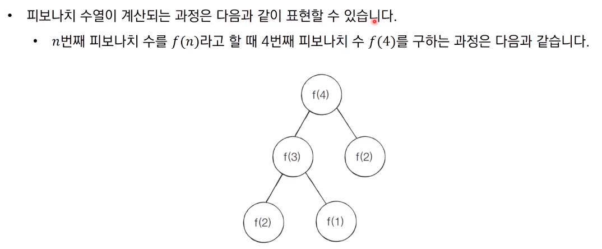

# 다이나믹 프로그래밍

* 다이나믹 프로그래밍은 메모리를 적절히 사용하여 수행시간 효율성을 비약적으로 향상시키는 방법
* 이미 계산된 결과(작은 문제)는 별도의 메모리 영역에 저장하여 다시 계산하지 않도록 한다
* 다이나믹 프로그래밍의 구현은 일반적으로 두가지 방식(탑다운/바텀업)으로 구성된다
* 다이나믹 프로그래밍은 동적 계획법이라고도 부른다
* 일반적인 프로그래밍 분야에서의 동적이란?
  * 자료구조에서 동적 할당은 프로그램이 실행되는 도중에 실행에 필요한 메모리를 할당하는 기법을 의미
  * 반면 다이나믹 프로그래밍에서 다이나믹은 별다른 의미 없이 사용된 단어이다
* 다이나믹 프로그래밍은 문제가 다음의 조건을 만족할때 사용할 수 있다
  1. 최적 부분 구조(Optimal Substructure)
     * 큰 문제를 작은 문제로 나눌 수 있으며 작은 문제의 답을 모아서 큰 문제를 해결할 수 있음
  2. 중복되는 부분 문제(Overlapping Subproblem)
     * 동일한 작은 문제를 반복적으로 해결해야 함


## 피보나치 수열

* 피보나치 수열

$$
1, 1, 2, 3, 5, 8, 13, 21, 34, 55, 89,...
$$

* 점화식이란 인접한 항들 사이의 관계식을 의미
* 피보나치 수열을 점화식으로 표현하면 다음과 같음

$$
a_n = a_{n-1}+a_{n-2}, a_1=1, a_2=1
$$




## 피보나치 수열 코드 : 단순 재귀 

```python
#피보나치 수열 단순 재귀 소스코드
def fibo(x):
    if x==1 or x==2 :
        return 1
    return fibo(x-1)+fibo(x-2)
print(fibo(4))
```


## 피보나치 수열의 효율적인 해법 : 다이나믹 프로그래밍

* 다이나믹 프로그래밍의 사용 조건을 만족하는지 확인
  1. 최적 부분 구조 : 큰 문제를 작은 문제로 나눌 수 있다
  2. 중복되는 부분 문제 : 동일한 작은 문제를 반복적으로 해결
* 피보나치 수열은 다이나믹 프로그래밍의 사용 조건을 만족


## 메모이제이션(하향식)

* 메모이제이션은 다이나믹 프로그래밍을 구현하는 방법중 하나
* 한번 계산한 결과를 메모리 공간에 메모하는 기법
  * 같은 문제를 다시 호출하면 메모했던 결과를 그대로 가져온다
  * 값을 기록해 놓는다는 점에서 캐싱(Caching)이라고도 한다


## 탑다운 vs 바텀업

* 탑다운(메모이제이션) 방식은 하향식이라고도 하며 바텀업 방식은 상향식이라고도 한다
* 다이나믹 프로그래밍의 전형적인 형태는 바텀업 방식
  * 결과 저장용 리스트는 DP 테이블이라고 부른다
* 엄밀히 말하면 메모이제이션은 이전에 계산된 결과를 일시적으로 기록해 놓는 넓은 개념을 의미
  * 따라서 메모이제이션은 다이나믹 프로그래밍에 국한된 개념은 아니다
  * 한 번 계산된 결과를 담아 놓기만 하고 다이나믹 프로그래밍을 위해 활용하지 않을 수도 있다

```python
#한 번 계산된 결과를 메모이제이션하기 위한 리스트 초기화
d = [0] * 100

#피보나치 함수를 재귀함수로 구현(탑다운)
def fibo(x):
    #종료조건(1 혹은 2 일때 1을 반환)
    if x==1 or x==2:
        return 1
    #이미 계산한 적 있는 문제라면 그대로 반환
    if d[x] != 0:
        return d[x]
    #아직 계산하지 않은 문제라면 점화식에 따라서 피보나치 결과 반환
    d[x] = fibo(x-1) + fibo(x-2)
    return d[x]

print(fibo(99))

#피보나치 함수(바텀업)
#앞서 계산된 결과를 저장하기 위한 DP테이블 초기화
d = [0] * 100

#첫번째 피보나치 수와 두번째 피보나치 수는 1
d[1] = 1
d[2] = 1
n = 99

#피보나치 함수 반복문으로 구현(바텀업)
for i in range(3, n+1):
    d[i] = d[i-1] + d[i-2]

print(d[n])
```


## 다이나믹 프로그래밍 vs 분할 정복

* 다이나믹 프로그래밍과 분할 정복은 모두 **최적 부분 구조**를 가질 때 사용할 수 있다
  * 큰 문제를 작은 문제로 나눌 수 있으며 작은 문제의 답을 모아서 큰 문제를 해결할 수 있는 상황
* 다이나믹 프로그래밍과 분할 정복의 차이점은 부분 문제의 중복이다
  * 다이나믹 프로그래밍 문제에서는 각 부분 문제들이 서로 영향을 미치며 부분 문제가 중복된다
  * 분할 정복 문제에서는 동일한 부분 문제가 반복적으로 계산되지 않는다


참고 코드 : PythonStudy/00_SideStudy/01_Algorithm/25_dynamic_programming.py

