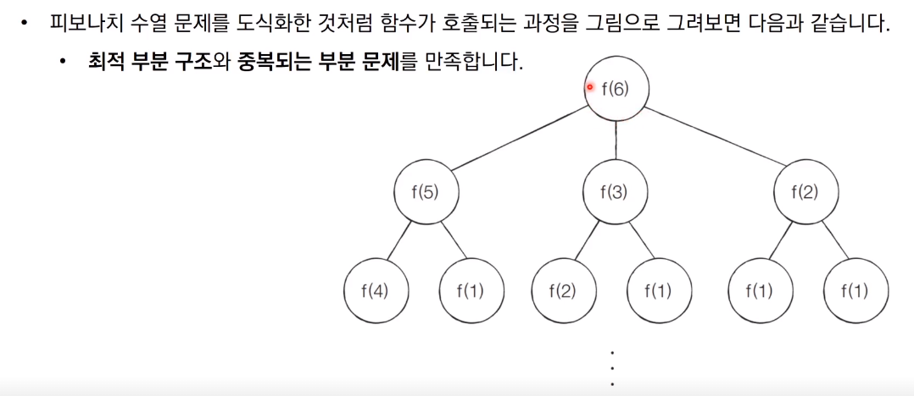
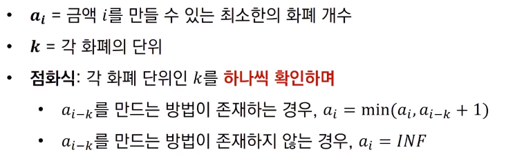

# 다양한 동적 계획법 문제

## 문제1) 개미 전사

## 문제2) 1로 만들기

## 문제3) 효율적인 화폐 구성

## 금광

## 병사 배치하기

참고 코드 : PythonStudy/00_SideStudy/01_Algorithm/26_1_exam1.py

참고 코드 : PythonStudy/00_SideStudy/01_Algorithm/26_2_exam2.py

참고 코드 : PythonStudy/00_SideStudy/01_Algorithm/26_3_exam3.py

참고 코드 : PythonStudy/00_SideStudy/01_Algorithm/26_4_exam4.py

참고 코드 : PythonStudy/00_SideStudy/01_Algorithm/26_5_exam5.py

