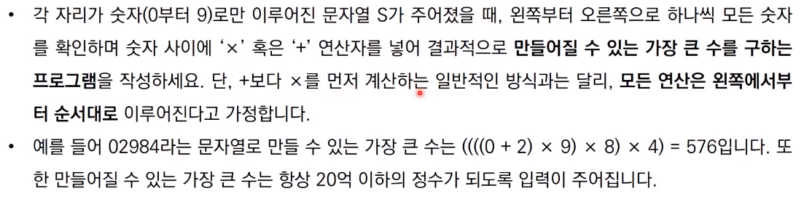

# 그리디 알고리즘

* 그리디 알고리즘은 **현재 상황에서 지금 당장 좋은 것만 고르는 방법**을 의미한다
* 일반적인 그리디 알고리즘은 문제를 풀기 위한 최소한의 아이디어를 떠올릴 수 있는 능력을 요구한다
* 그리디 해법은 그 정당성 분석이 중요하다
  * 단순히 가장 좋아 보이는 것을 반복적으로 선택해도 최적의 해를 구할 수 있는지 검토한다
* 일반적인 상황에서 그리디 알고리즘은 최적의 해를 보장할 수 없을 때가 많다
* 하지만 코딩테스트에서의 대부분의 그리디 문제는 **탐욕법으로 얻은 해가 최적의 해가 되는 상황에서, 이를 추론**할 수 있어야 풀리도록 출제된다

## 거스름 돈 문제

### 거스름 돈 : 정당성 분석

## 1이 될 때까지 문제

### 1이 될 때까지 : 정당성 분석

## 곱하기 혹은 더하기 문제

## 모험가 길드 문제

참고 코드 : PythonStudy/00_SideStudy/01_Algorithm/27_greedy.py
