# 구현

* 흔히 알고리즘 대회에서 구현 유형이란?
  * 풀이를 떠올리는 것은 쉽지만 소스코드로 옮기기 어려운 문제
* 구현 유형의 예시
  * 알고리즘은 간단한데 코드가 지나칠 만큼 길어지는 문제
  * 실수 연산을 다루고 특정 소수점 자리까지 출력해야 하는 문제
  * 문자열을 특정한 기준에 따라서 끊어 처리해야 하는 문제
  * 적절한 라이브러리를 찾아서 사용해야 하는 문제

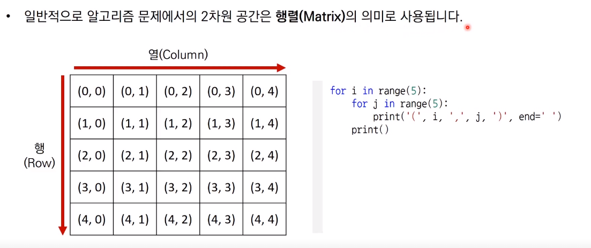

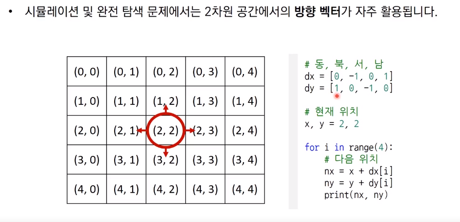

## 상하좌우 문제

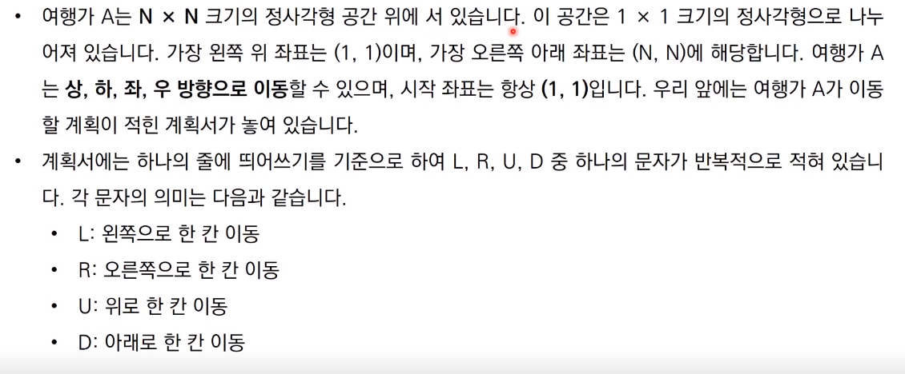

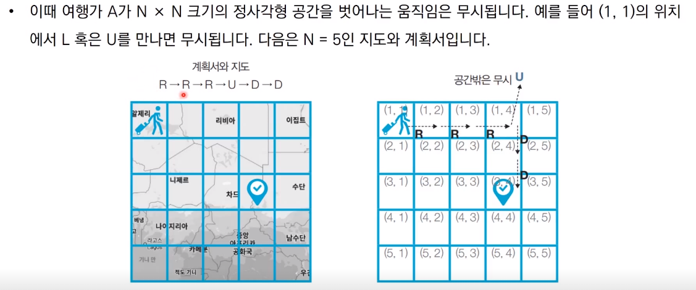

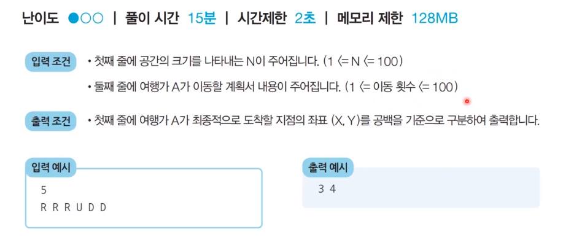

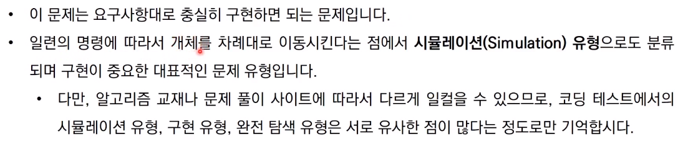

## 시각 문제

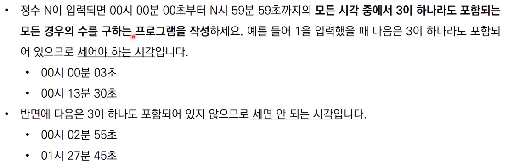

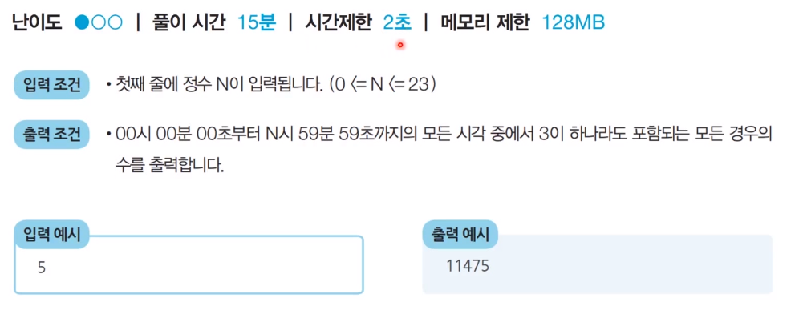

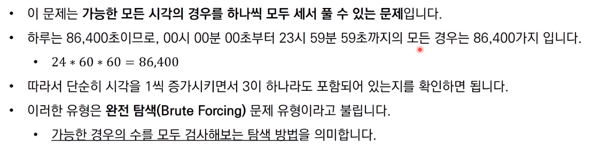

## 왕실의 나이트 문제

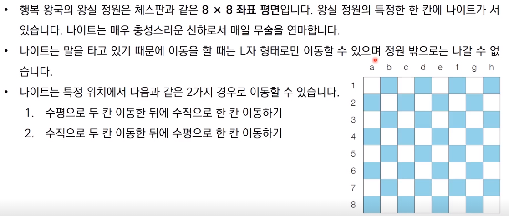

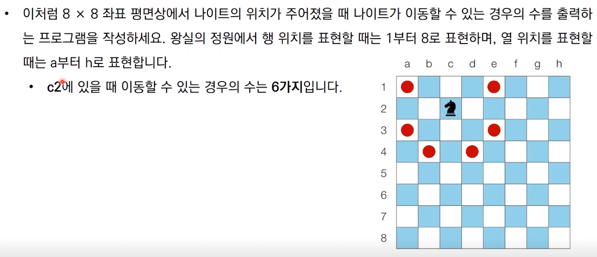

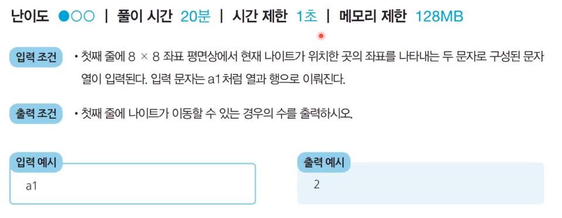

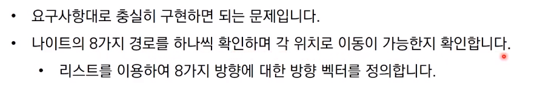

## 문자의 재정렬 문제

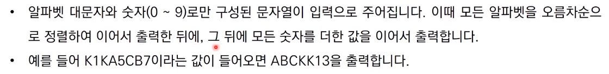

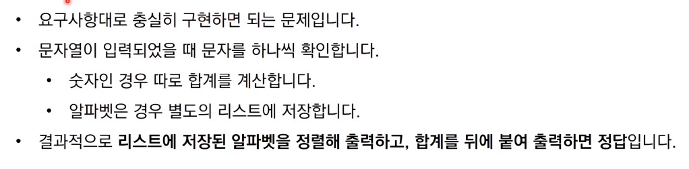

참고 코드 : PythonStudy/00_SideStudy/01_Algorithm/28_implement.py

