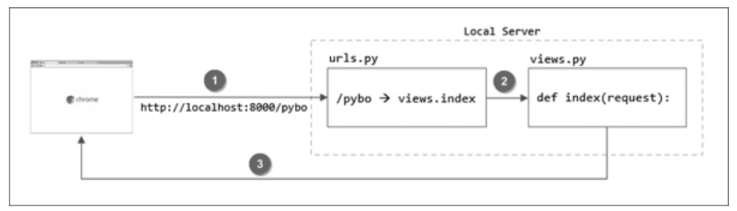

# 앱 시작하기

* 앱 생성 : `django-admin startapp pybo`
  * pybo라는 앱 생성(디렉토리에서 확인 가능)

## Hello pybo

localhost:8000/pybo 접속 시 404에러


1. urls.py 파일 수정

   ```python
   from django.contrib import admin
   from django.urls import path
   from pybo import views #추가
   
   urlpatterns = [
       path('admin/', admin.site.urls),
       path('pybo/', views.index), #추가
   ]
   ```

2. views.py 수정

   ```python
   from django.shortcuts import render
   from django.http import HttpResponse #추가
   
   # Create your views here.
   def index(request): #추가
       return HttpResponse('안녕하세요 pybo에 오신걸 환영합니다')
   ```

3. localhost 접속 시 메시지 출력 확인

## 장고 개발 흐름 정리



1. 로컬서버로 http://localhost:8000/pybo 페이지를 요청
2. urls.py 파일에서 /pybo URL매핑을 확인하여 views.py 파일의 index 함수를 호출
3. 호출한 결과를 브라우저에 반영