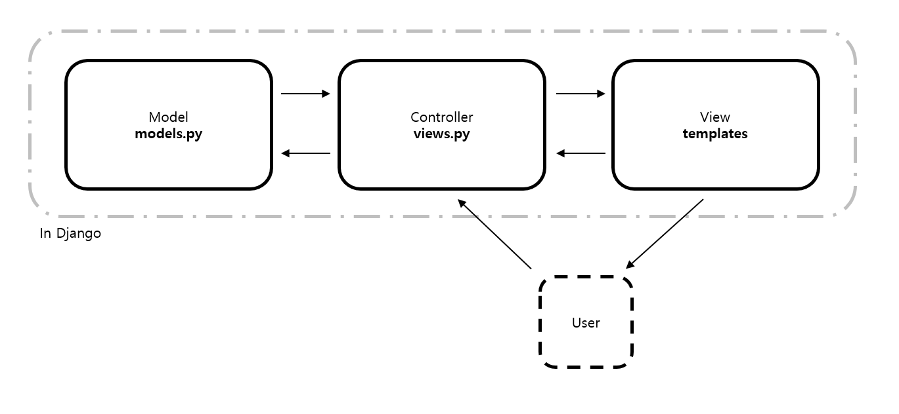

# MVC(Model, View, Controller)

## Model

* '어떤 것'을 의미
* 대표적으로 웹에서 백엔드에 존재하는 데이터베이스를 의미

## View

* 사용자에게 '보여주는 것'을 의미
* 대표적으로 HTML파일을 사용자에게 보여주는 것

## Controller

* Model과 View를 컨트롤하는 역할
* 사용자가 View를 통해 Controller에게 요청을 보내면, Controller는 내부적으로 특정한 처리를 진행
* 이때 필요하다면 Model에서 데이터를 가져오는 작업이 진행됨
* 그 후 처리된 결과를 다시 View로 사용자에게 보이게 함

## Web에서 진행되는 사용자의 로그인 과정 비교

| MVC 패턴                                                     | Web                                                         |
| ------------------------------------------------------------ | ----------------------------------------------------------- |
| 1. 사용자가 View를 통해 확인한다                             | 1. 사용자가 Web 화면을 본다                                 |
| 2. 사용자가 A라는 액션을 취한다                              | 2. 사용자가 ID, PW를 입력하여 로그인 버튼을 누른다          |
| 3. Controller는 액션을 처리한다                              | 3. Controller는 사용자가 입력한 ID와 PW를 받는다            |
| 4. 필요하다면 Model에서 데이터를 참조한다                    | 4. ID와 PW가 정상적인 User인지 데이터베이스를 통해 확인한다 |
| 5. Controller는 액션을 마저 처리한다                         | 5. 정상적인 User이므로 로그인 완료 결과를 만든다            |
| 6. Controller는 처리된 결과를 View를 통해 사용자에게 보여준다 | 6. 로그인 완료 페이지를 사용자에게 보여준다                 |

## 장고에서의 MVC 패턴

