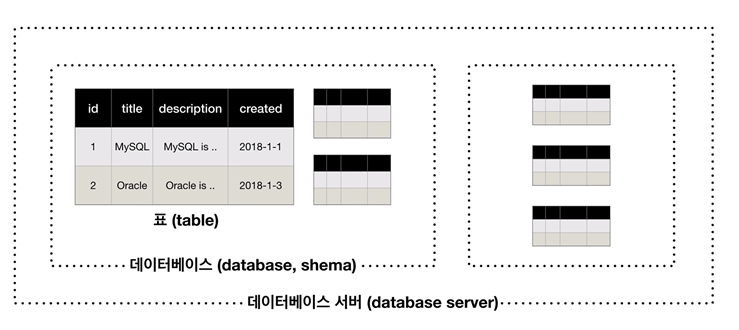

# MYSQL

## SQL 기초



* 스키마 - 연결된 데이터들을 그룹핑한 것

* 데이터베이스 서버 – 스키마들의 집합

 

## SQL 명령어


| 명령어                    | 동작                            |
| ------------------------- | ------------------------------- |
| `CREATE DATABASE DBNAME;` | DATABASE 만들기                 |
| `DROP DATABASE DBNAME;`   | DATABASE 삭제                   |
| `SHOW DATABASES;`         | DATABASE 확인                   |
| `USE DBNAME;`             | 특정 데이터베이스 사용          |
| `SHOW TABLES;`            | 현재 데이터 베이스의 table 확인 |


* Sql의 데이터타입 : int, bigint, char, varchar 등


### 테이블 생성 예시

```sql
CREATE TABLE topic(			--auto_increment 값을 자동으로 1씩 증가
	Id int(11) not null auto_increment, --not null 값이 없는 것을 허용하지 않음
	title varchar(100) not null,
	description text null,
	created datetime not null,
	author varchar(30) null,
	profile varchar(100) null,
	primary key(id) #primary key 생성

```


## CRUD

### INSERT

* `DESC 테이블이름;` 을 실행하면 테이블의 형태를 볼 수 있다

* date에 now()를 사용하면 현재시간이 자동으로 입력됨

```sql 
INSERT INTO topic(title,description,created,author,profile) VALUES ('mysql','mysql is ...',now(),'egoing','developer'); 
```


### SELECT

* `SELECT * FROM 테이블이름`

```sql 
Select id,title,created,author FROM topic;
--Id,title,created,author를 출력
```

* WHERE 사용(=,<,>,in,like 등 사용 가능)

```sql
SELECT id,title,created,author FROM topic WHERE author = 'egoing';
--author 에서 egoing만 출력
```

* ORDER BY 사용

```sql
SELECT id,title,created,author FROM topic WHERE author=’egoing’ ORDER BY id DESC;
--id 기준으로 내림차순 정렬
```

* AS 사용 – 컬럼에 alias(별칭) 부여

```sql
SELECT empno AS 사번 FROM employee;  
--empno 컬럼명을 사번으로 바꾸어 출력
```

* CONCAT 사용 – 컬럼의 합성

```sql
SELECT CONCAT(empno,'-',deptno) AS '사번-부서번호' FROM employee; 
--사번과 부서번호를 하나의 컬럼으로 변환하여 출력
```

* DISTINCT 사용 – 중복행 제거

```sql
SELECT DISTINCT deptno FROM employee;
--deptno 컬럼에서 중복행 제거 후 출력
```


### UPDATE

* `UPDATE 테이블 SET 바꿔줄 데이터 + 조건`

```sql 
UPDATE topic SET description='oracle is …!', title = ‘Oracle’ WHERE id=2;
--Id가 2인 행에 Title을 Oracle로, description을 oracle is …! 으로 바꿔줌 
```


### DELETE

* DELETE 사용시에는 반드시 WHERE을 사용해야함(데이터 삭제 위험)

```sql
DELETE FROM topic WHERE id = 5;
--id값이 5인 행을 삭제
```


