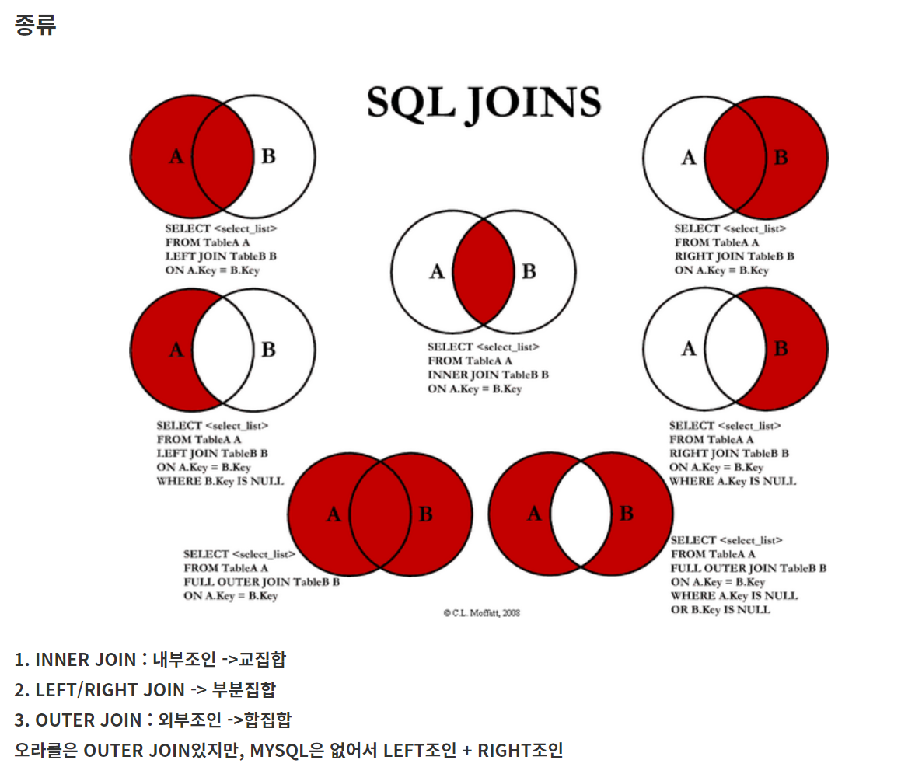
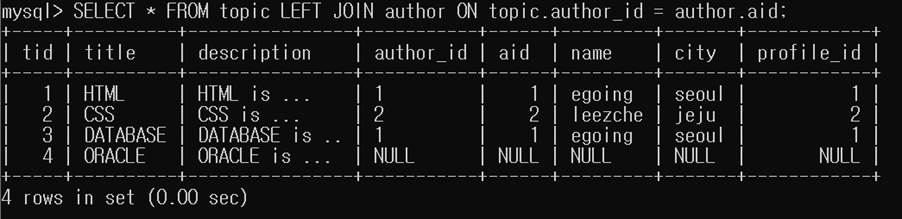
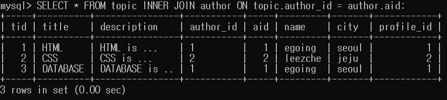
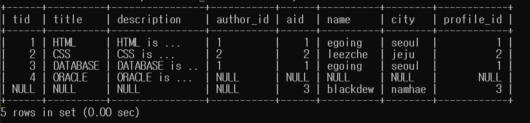
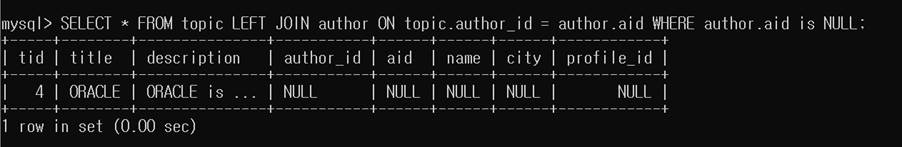

# JOIN

* 둘 이상의 테이블을 연결해서 데이터를 검색하는 방법
* 연결하려면 테이블들이 적어도 하나의 컬럼을 공유하고 있어야 함
* 이 공유하고 있는 컬럼을 PK 또는 FK 값으로 사용



* JOIN에 필요한 표 만들기

 ```sql
 DROP TABLE IF EXISTS `author`;
  
 
 CREATE TABLE `author` (
 `aid` int(11) NOT NULL,
 `name` varchar(10) DEFAULT NULL,
 `city` varchar(10) DEFAULT NULL,
 `profile_id` int(11) DEFAULT NULL,
 PRIMARY KEY (`aid`)
 ) ENGINE=InnoDB DEFAULT CHARSET=utf8;
 
 INSERT INTO `author` VALUES (1,'egoing','seoul',1),(2,'leezche','jeju',2),(3,'blackdew','namhae',3);
 
 DROP TABLE IF EXISTS `profile`;
 
 CREATE TABLE `profile` (
 `pid` int(11) NOT NULL,
 `title` varchar(10) DEFAULT NULL,
 `description` tinytext,
 PRIMARY KEY (`pid`)
 ) ENGINE=InnoDB DEFAULT CHARSET=utf8;
 
 INSERT INTO `profile` VALUES (1,'developer','developer is ...'),(2,'designer','designer is ..'),(3,'DBA','DBA is ...');
 
 DROP TABLE IF EXISTS `topic`;
 
 CREATE TABLE `topic` (
 `tid` int(11) NOT NULL,
 `title` varchar(45) DEFAULT NULL,
 `description` tinytext,
 `author_id` varchar(45) DEFAULT NULL,
 PRIMARY KEY (`tid`)
 ) ENGINE=InnoDB DEFAULT CHARSET=utf8;
 
 INSERT INTO `topic` VALUES (1,'HTML','HTML is ...','1'),(2,'CSS','CSS is ...','2'),(3, 'DATABASE','DATABASE is ..','1'),(4,'ORACLE','ORACLE is ...',NULL);
 ```


## LEFT JOIN

* 왼쪽의 테이블의 행을 기준으로 출력

* Topic 테이블을 왼쪽에 놓고 author 테이블을 조인하는데 topic.author_id 와 author.aid를 기준으로 
* JOIN하려는 행이 비어있으면 NULL값 표시

`SELECT * FROM topic LEFT JOIN author ON topic.author_id = author.aid;`




* 위의 표에 PROFILE 테이블도 이어붙임

`SELECT * FROM topic LEFT JOIN author ON topic.author_id = author.aid LEFT JOIN profile ON author.profile_id = profile.pid;`


* 출력하고 싶은 컬럼 설정

`SELECT tid, topic.title, author_id, name, profile.title AS job_title FROM topic LEFT JOIN author ON topic.author_id = author.aid LEFT JOIN profile ON author.profile_id = profile.pid;`


* 위의 표에서 aid(author_id)가 1인것만 출력

`SELECT tid, topic.title, author_id, name, profile.title AS job_title FROM topic LEFT JOIN author ON topic.author_id = author.aid LEFT JOIN profile ON author.profile_id = profile.pid WHERE aid = 1;`


## INNER JOIN

* 양쪽의 표에 공통되는 행만 가지고 표를 만듦(교집합)

 `SELECT * FROM topic INNER JOIN author ON topic.author_id = author.aid;`


## FULL JOIN

* 양쪽의 모든 행을 가지고 표를 만듦(합집합)

* SELECT * FROM topic FULL OUTER JOIN author ON topic.author_id = author.id;

* MYSQL은 FULL JOIN을 지원하지 않아 아래방법으로 실행

`(SELECT * FROM topic LEFT JOIN author ON topic.author_id = author.aid) UNION (SELECT * FROM topic RIGHT JOIN author ON topic.author_id = author.aid);`

* LEFT JOIN과 RIGHT JOIN을 해서 UNION (DISTINCT는 생략된 것)로 중복을 제거해 합쳐줌




## EXCLUSIVE LEFT JOIN

`SELECT * FROM topic LEFT JOIN author ON topic.author_id = author.aid WHERE author.aid is NULL;`

