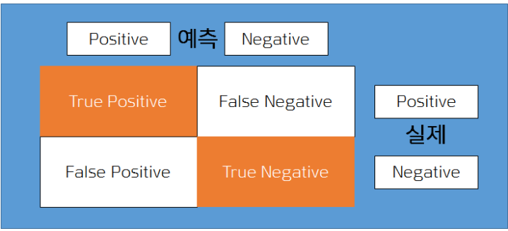
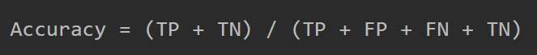
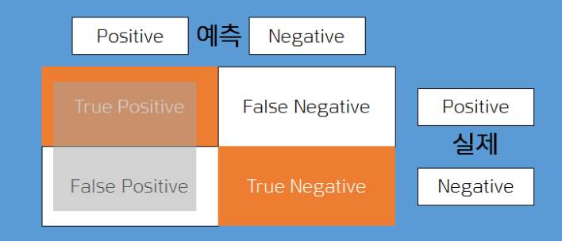
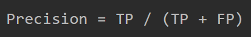
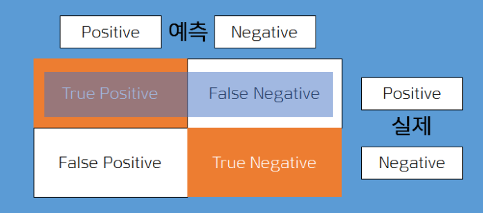
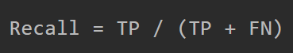
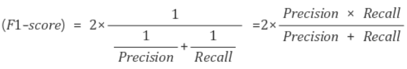

# Metric 척도


## 척도란?

* 모델을 평가(Evaluate)하기 위해서 사용하는 값
* 척도와 손실함수
  * 손실함수(loss function) : 모델의 성능을 끌어올리기 위해서 참조하는 값이다. 즉, 트레이닝(training, 학습)을 위해서만 사용하는 나침반과 같은 존재
  * 척도 : 결과적으로 이 모델의 성능은 얼마짜리야라는 개념


## 척도의 종류



* 정확도(Accuracy) : 가장 많이 쓰이는 개념으로 타겟 대비 정확히 예측한 비율



* 정밀도(Precision) : 모델이 참(True)으로 예측한 것 중 실제로 True인 비율






* 재현율(Recall) : 실제로 참(True)인 것 중에서 모델이 참(True)로 예측한 비율






* F1 Score : Accuracy와 함께 인기있는 척도 중 하나. 정밀도와 재현율의 조화 편균을 나타내는 것으로 분류기 등을 만들 때 Precision과 Recall 사이에서 절충이 이루어지며 특이값의 리스크를 회피할 수 있다.



 * F1 Score 예시

    * ```python
       Precision = 1
       Recall = 0.1
      ```

    * 둘간의 온도차가 존재하며 모델이 잘못되었다고 평가할 수 있다

    * 하지만 단순히 정밀도와 재현율의 평균을 구하게 되면 다음과 같다

    * ```python
      (1 + 0.1) / 2 = 0.55
      ```

    * 단순 평균을 구하면 0.1이라는 값이 희석되어 버림

    * F1 공식 적용

    * ```python
      2 * (1 * 0.1) / (1 + 0.1) = 0.1818...
      ```

   	* F1 socre가 0.1818이 나왔고 이를 통해 모델에 문제가 있음을 확인할 수 있다

