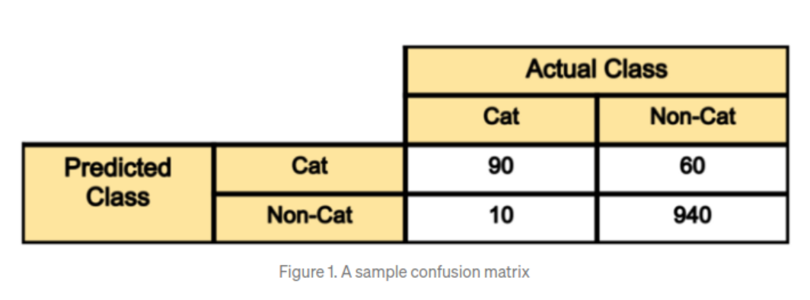
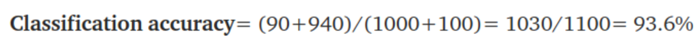
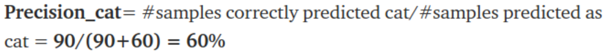
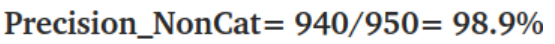
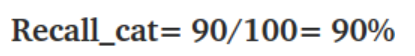
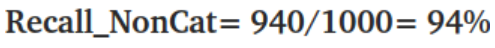
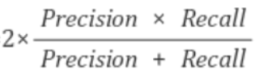

# metric example

## 고양이 분류 데이터

* 고양이 사진과 고양이가 아닌 사진을 구별해주는 분류모델을 만든다고 가정
* test set은 1100장, 그 중 1000장은 non-cat images, 나머지 100장은 cat images
* 아래의 confusion matrix를 통해 확인

1. **100장의 cat images중** model은 90장을 정확히 판단**(true-positive)**, 10장을 잘못 판단**(false-negative)**
2. **1000장의 non-cat images중**에 model은 940장의 고양이가 아닌 사진을 정확히 고양이가 아니라고 판단**(true-negative)**, 나머지 60장의 고양이가 아닌 사진을 고양이라고 판단**(false-positive)**

### Classification Accuracy

* 가장 단순한 metric
* 상단 예시로 classification accuracy는 93.6%

* 허나 단순한 classification accuracy는 좋은 지표가 아님
* 표본의 class가 불균형한 상태(imbalanced class)를 생각해 보자. 구체적으로 의료 데이터를 예로 들어 병이 없는 정상 데이터가 전체의 98%이고 병이 있는 데이터가 2%라고 가정해보자. 여기서 **단순히 모든 결과를 병이 없다고 모델이 예측했을때, classification accuracy는 98%**라는 높은 성능을 나타낸다. 모델이 학습이 안되어도 예측을 정상입니다만 해도 98%의 classification Accuracy를 가지게 되는것이다. 이는 **대참사**를 불러올 수 있다

### Precision

* Precision = TP/(TP+FP)
  * Cat 기준 Precision

  

  * Non-Cat 기준 Precision
  
  
  
* 모델은 고양이 사진이라고 판단했을때 정답일 경우가 **60%**, 고양이가 아니라고 판단했을때 정답일 경우가 **98.9%**
* 이는 전체 데이터 개수를 봤을때 cat image는 100장 밖에 없고, non-cat image는 1000장으로 훨씬 많기 때문에(학습이 잘 되었기 때문에) 당연한 결과이다.

### Recall

* Recall은 **'재현율'**이라고도 불린다

* Recall = TP/(TP+FN)

  * Cat 기준 Recall

  

  * Non-cat 기준 Recall

* 실제 고양이 사진 100장 중에 90장을 고양이(90%)라고 판단했다. 반대로, 고양이가 아닌 사진 1000장 중에 940장을 고양이가 아니(94%)라고 판단했다.

### F1-Score

* F1-Score = 

  * Cat 기준 F1-Score

    * 2 * ((0.6 * 0.9) / (0.6 + 0.9)) = 0.72

  * Non Cat 기준 F1-Score

    * 2 * ((0.989 * 0.94) / (0.989 + 0.94)) = 0.9638...

    
