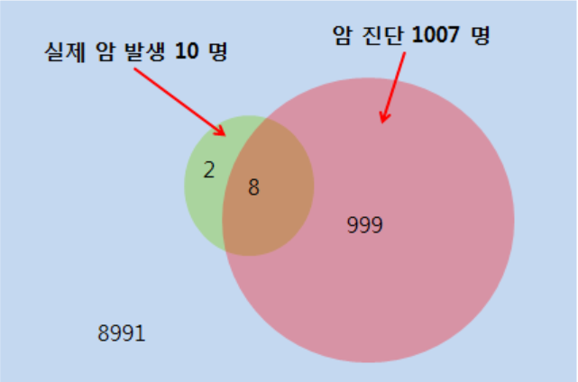
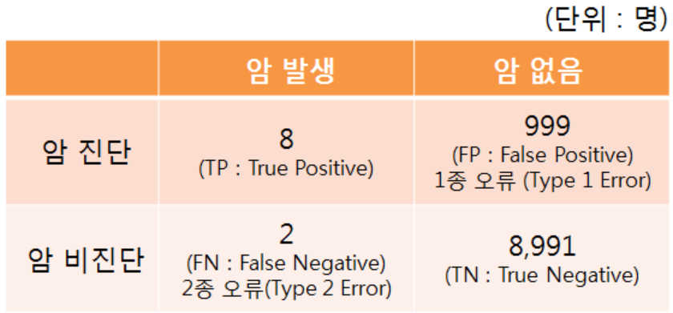
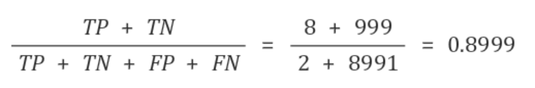
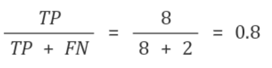
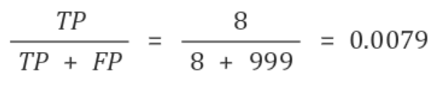
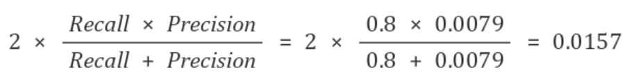

# metric example2

## 암 진단 키트 개발

예제 배경 설명> 

 우리는 통계적으로 암 발생확률이 0.1% 라고 알려져 있는 가상세계에 살고있다. 이에 암 진단키트를 개발하여 10,000명을 대상으로 임상시험을 하였으며, 실제 암환자 10명 중 8명이 양성반응을 보이는 것을 확인하여 80%의 검출 성능이 있다고 판단했다. 하지만 암이 없는 환자 999명 또한 암으로 진단되어 혼란스러워 했다. 

 이에 정확도를 계산해보니 전체 표본 10,000명 중 8,999명(암진단 8명 + 암 없음 8,991명)을 제대로 진단했으므로, 암 진단키트는 약 90%의 정확도를 가진다고 결론을 내렸다.

 어느 날, 한 사람이 이 진단키트의 평가 방법(정확도 산출)이 잘못되었다고 주장했다.

 **무엇이 문제일까?**

* 2명 : 암으로 진단되지 않은 암 환자 - X (2종 오류)

* 8명 : 암으로 진단된 암 환자 - O

* 999명 : 암으로 진단된 정상인 - X (1종 오류)

* 8,991명 : 암으로 진단되지 않은 정상인 -O

## Confusion matrix

### Accuracy

* 전체 데이터 중 정확한 진단을 내린 비율
* 대부분 Accuracy를 가지고 평가함

* 하지만 이 예시의 경우, 데이터 분포가 ***불균형(Unbalance)**하기 때문에 Accuracy를 사용하면 안된다    

  *암환자와 암이 아닌 사람의 비율이 불균형

### Recall

* 실제 암이 발생한 사람 중 정확히 암 진단을 내린 경우
* TPR(True Positive Rate)이라고도 부르는데 이를 구현하면 0.8
* Recall은 FN을 감안하지 않기 때문에 Recall만 가지고 데이터를 판단하기에는 문제가 있다

### Precision

* PPV(Positive Predictive Value)라고도 한다
* 실제 암진단을 받은 사람 중 정확히 암진단을 받은 경우이다
* Precision은 FP를 감안하지 않기 때문에 Precision만 가지고 데이터를 판단하기에는 문제가 있다

### F1-Score

* Accuracy, Recall, Precision 이 세가지 중 한가지 지표만 가지고 데이터를 판단하기에는 무리가 있기 때문에 도입된 개념
* F1 Score는 Recall과 Precision의 조화평균을 사용한다. 이유는 두 값중 어느 한가지 값이라도 극단적으로 낮을때 F1-Score도 낮게 나오고, 두 값 모두 높아야만 F1-Score가 높게 나올 수 있기 때문이다

## 결론

위 예제는 데이터가 불균형하기 때문에 Accuracy로 평가하는 것이 문제가 있으며, F1 Score로 평가하는 것이 적절해 보인다. F1 Score는 0.0157 이므로 이 진단키트는 사용하는데 문제가 있다고 평가할 수 있다. (쉽게 생각하면 약 1.5%의 확률로 진단키트가 정상 동작한다고도 볼 수 있다.)

 *1종 오류나 2종 오류가 매우 치명적인 경우에는 그 오류를 피하기 위해서 Precision이나 Recall 중 한 가지에 비중을 높여 평가해야 하는 경우도 있다.